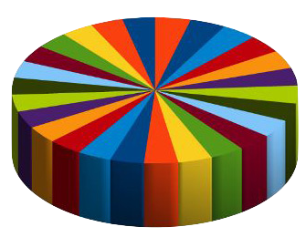

## Assignment

<div style= "float:right;position: relative; margin-left: 20px">
```{r setup, echo=FALSE, fig.align="right"}

```
</div>

Use any software you like to improve the data visualization assigned to your lab section. Click the link to see the original "ugly chart". The dataset is available in the **hw-01-** repo on GitHub.

- Lab 01L (1:25p - 2:40p): [Fishing Industry by Country](https://prodduke-my.sharepoint.com/:x:/g/personal/mt324_duke_edu/ESrXch7iGZBKgY-pO_7xQxQBSrT7ZcA9lXfcBEQQYoLj-Q?e=E1tSQ8)
- Lab 02L (3:05p - 4:20p): [Instructional Staff Employment Trends](https://prodduke-my.sharepoint.com/:x:/g/personal/mt324_duke_edu/EdFKonWjzZdDlzYTR9glHMABqlzzzoEY3YTNem8_ZN4O5g?e=PnIJya)
- Lab 03L (4:40p - 5:55p): [NERRS Nutrient Data](https://prodduke-my.sharepoint.com/:x:/g/personal/mt324_duke_edu/EdpksWQFP9BIpFd798gbnvMBxyyK5elA365DJBjUNQgP9A?e=kUrtmk)


## Help


- `gather` function to transform data from wide to long format: 
    - [https://tidyr.tidyverse.org/reference/gather.html](https://tidyr.tidyverse.org/reference/gather.html)

- `ggplot`
    - [https://ggplot2.tidyverse.org/reference/index.html](https://ggplot2.tidyverse.org/reference/index.html)
    - [ggplot2 Cheat Sheet](https://www.rstudio.com/wp-content/uploads/2016/11/ggplot2-cheatsheet-2.1.pdf)


## Want to see more ugly charts?

- [Flowing Data - Ugly Charts](https://flowingdata.com/category/visualization/ugly-visualization/)


## Grading

Check / no check
