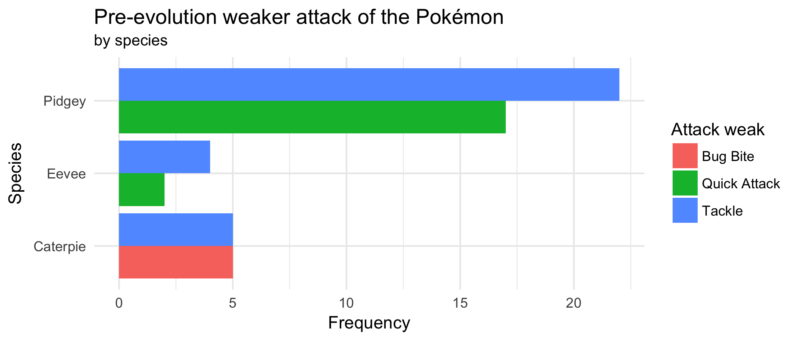

```{r include=FALSE}
library(tidyverse)
pokemon <- read_csv("data/pokemon.csv")
```

<div style= "float:right;position: relative; margin-left: 20px">
```{r setup, echo=FALSE, fig.align="right"}
knitr::include_graphics("img/hw-02-pikachu.png")
```
</div>

## Introduction

A key part of [Pokémon Go](http://www.pokemongo.com/) is using evolutions to get stronger Pokémon, and a deeper understanding of evolutions is key to being the greatest Pokémon Go player of all time. The data set you will be working with for this assignment covers 75 Pokémon evolutions spread across four species. A wide set of variables are provided, allowing a deeper dive into what characteristics are important in predicting a Pokémon's final combat power (CP).

## Getting started

Here are the steps for getting started:

- Find the **hw-02-** repo on GitHub
- Clone this repo in RStudio Cloud
- Configure git using the `use_git_config()` function
- Make any changes needed as outlined by the tasks you need to complete for the assignment
- Make sure all your code chunks are informatively named, there are no spaces in the labels, and these labels re not repeated
- Periodically commit changes (the more often the better, for example, once per each new task)
- Push all your changes back to your GitHub repo

and voila, you're done! Once you push your changes back you do not need to do anything else to "submit" your work. And you can of course push multiple times throughout the assignment. At the time of the deadline we will take whatever is in your repo and consider it your final submission, and grade the state of your work at that time (which means even if you made mistakes before then, you wouldn't be penalized for them as long as the final state of your work is correct).

## Data

Go to the [codebook](https://www.openintro.org/stat/data/?data=pokemon) and find out which variables are included in this dataset, and what they represent.

## Questions

For each exercise, write down an interpretation of your visualization (and what it reveals about the data) in 1-2 sentences max.

1. Calculate the difference in heights pre and post evolution and save this as a new variable. Calculate the percentage of pokemon that grew during evolution. Also visualize the distribution of change in height by species and provide a discussion of how change in height varies across species.

2. Recreate the following plot.



3. Calculate the relative frequency of `attack_strong_new` based on levels of `attack_strong`. That is, the relative frequency of post-evolution stronger attack based on the pre-evolution stronger attack. Do Pokemon tend to change their strong attack post-evolution?

4. Pick two categorical variables and make a bar plot that depicts the relationship between them. These can be variables from the original data or ones that you create based on the given data.

5. Pick a numerical and a categorical variable, and construct side-by-side box plots depicting the relationship between them.

6. Learn something new: violin plots! Read about them at [http://ggplot2.tidyverse.org/reference/geom_violin.html](http://ggplot2.tidyverse.org/reference/geom_violin.html), and convert your side-by-side box plots from the previous task to violin plots. Add the `draw_quantiles = c(0.25, 0.5, 0.75)` to see the first, second and third quantiles. What, do the violin plots reveal that box plots do not? What features are apparent in the box plots but not in the violin plots?

To answer, it may help to view multiple examples of each plot type. Visit the link above to see more examples of violin plots. Visit the `geom_boxplot` reference page ([https://ggplot2.tidyverse.org/reference/geom_boxplot.html](https://ggplot2.tidyverse.org/reference/geom_boxplot.html)) to see more examples of box plots. 

7. What characteristics correspond to an evolved Pokémon with a high combat power? You do not need to come up with an exhaustive list, but you should walk us through your reasoning for answering this question and include all relevant summary statistics and visualizations.

When you're done, review the .md document on GitHub to make sure you're happy with the final state of your work. 

## Getting help

Use Piazza to ask questions about the assignment. 

You are also welcomed to discuss the homework with each other broadly (no sharing code!) as well as ask questions at office hours.

## Academic integrity

This is an **individual** assignment. You are welcomed to exchange ideas with classmates and ask questions on the getting help channels discussed above however you may not share your text or code answers directly with classmates.

The Duke Community Standard applies and course academic integrity policies apply. Please review them [here](http://www2.stat.duke.edu/courses/Spring18/Sta199/policies/#academic-integrity). Specifically, the note on sharing / reusing code.

## Grading

Total                                                   | 100 pts
--------------------------------------------------------|--------
Questions 1-6                                           | 60 pts
Question 7                                              | 20 pts
Informatively named code chunks                         | 5 pts
Regular commits                                         | 2 pts
Informative commit messages                             | 3 pts
Document organization                                   | 4 pts
Quality of grammar and writing                          | 6 pts

**Review your .md file on GitHub to make sure it is fully updated and includes all of your final output, graphs and narrative. There is a 10% penalty if the .Rmd file has to be knitted to display graphs, i.e. the graphs are not showing in the .md file on GitHub.**