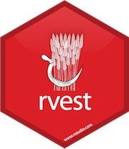

<br>

```{r include=FALSE}
library(tidyverse)
```

```{r echo=FALSE, fig.align="right",out.width="25%", out.extra='style="float:right; padding:10px"'}

```

## Getting started

Here are the steps for getting started:

- Find the **hw-05-** repo on GitHub
- Clone this repo in RStudio Cloud
- Configure git using the `use_git_config()` function
- Make any changes needed as outlined by the tasks you need to complete for the assignment
- Make sure all your code chunks are informatively named, there are no spaces in the labels, and these labels re not repeated
- Periodically commit changes (the more often the better, for example, once per each new task)
- Push all your changes back to your GitHub repo

and voila, you're done! Once you push your changes back you do not need to do anything else to "submit" your work. And you can of course push multiple times throughout the assignment. At the time of the deadline we will take whatever is in your repo and consider it your final submission, and grade the state of your work at that time (which means even if you made mistakes before then, you wouldn't be penalized for them as long as the final state of your work is correct).
## Questions

### Part 1: Gender pay gap

Go to https://en.wikipedia.org/wiki/Gender_pay_gap and scrape the table under the section "By Country". Save your code in an R script called `paygap.R`, write the data frame out to a csv file called `paygap.csv` using the `write_csv` function. Store this file in the `data` folder.

For example, if your data frame is called `paygap`, you can use

```{r eval=FALSE}
write_csv(paygap, path = "data/paygap.csv")
```

1. Load `paygap.csv` in your R Markdown file.

2. Create a visualization similar to the one shown on the [Wikipedia page](https://en.wikipedia.org/wiki/Gender_pay_gap). You should try to match the graph on Wikipedia as closely as possible. Interpret the plot.

### Part 2: Video games

Go to http://www.metacritic.com/browse/games/score/metascore/year/all/filtered and scrape the data for videos games in the **first three pages of games released in 2018**. For each game grab the title, Metacritic and user score, release date, and URL to game's individual review page. (*Hint:* You will need to advance to the next page.) Save your code in an R script called `games.R`.

Next, write a function that scrapes the number of Metascore critics and user score ratings, genre(s), and rating for the video game from the video game's individual webpage. Then, apply this function to the second video game on the list. Finally, use mapping to get this information for the games in the **first three pages of games released in 2018**. (*Hint:* You might need to slow down your code with `Sys.sleep()`.)

Write the resulting data frame containing all of the information you scraped to a file called `games.csv` in the `data` folder.

3. Load `games.csv` in your R Markdown file.

4. Split the game title at the `(` character and create a new variable called `platform` with the information that is given in the parentheses. *(Hint:* There are functions for splitting columns. We haven't introduced them in class, so you'll need to do some digging.)

5. Create an indicator variable denoting whether one of the genre's of the game is `action` or not. What percent of the games on this list are action games? (*Hint:* Functions such as `str_detect()` from the stringr package might be helpful.)

6. Use visualizations and/or summary statistics to compare ratings of action vs. not action games.

7. Create one other visualization based on these data exploring an aspect of interest to you and interpret your findings. If you have no interest in video games, you can focus on how score and rating are related, if at all. (*Hint:* To help your narrative you might want to look up what the rating categories mean.)

## Getting help

Use Piazza to ask questions about the assignment. 

You are also welcomed to discuss the homework with each other broadly (no sharing code!) as well as ask questions at office hours.

## Grading

In addition to accuracy of your answers to questions, your homework submission will be 
evaluated for

- coding style
- informatively named code chunks
- commit after each question (at a minimum, more commits ok)
- informative commit messages
- document organization
- quality of narrative writing

## Academic integrity

This is an **individual** assignment. You are welcomed to exchange ideas with classmates and ask questions on the getting help channels discussed above however you may not share your text or code answers directly with classmates.

The Duke Community Standard applies and course academic integrity policies apply. Please review them [here](https://www2.stat.duke.edu/courses/Spring19/sta199.001/policies.html). Specifically, the note on sharing / reusing code.


