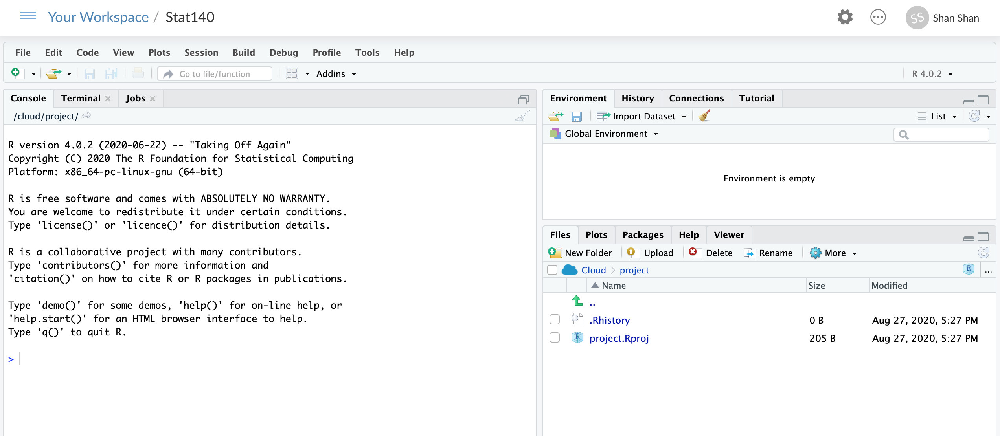

```{r global_options, include=FALSE}
knitr::opts_chunk$set(echo = TRUE)
library(dplyr)
library(ggplot2)
library(readr)
nhanes <- read_csv("https://raw.githubusercontent.com/sshanshans/stat140/master/docs/labs/data/nhanes.csv")
```
# 04 Exercise

## Introduction
In the past few days, you have been practicing your R skills on DataCamp and learning a whole lot about categorical variables. The goal of today's tutorial is to help you connect the two and introduce you to Rstudio, which you will be using throughout this course both to learn the statistical concepts discussed in the textbook and also to anlyze real data and come to informed conclusions. To straighten out which is which: **R is the name of the programming language itself and RStudio is a convenient interface**.

### The RStudio Interface

The goal of this assignment is to introduce you to RStudio and Rmarkdown, which you'll be using throughout the course both to learn the statistical concepts discussed in the course and to analyze real data and come to informed conclusions. 

As the assignment progress, you are encouraged to explore beyond what the assignment dictate; a willingness to experiment will make you a much better programmer and statistician.
Before we get to that stage, however, you need to build some basic fluency in Rstudio and Rmarkdown. 
Today we begin with the fundamental building blocks: the Rstudio interface, reading in data, and basic commands.

Go ahead and launch RStudio at the [Rstudio Cloud](https://rstudio.cloud)

You should see a window that looks like the image shown below.



The panel on the left is where the action happens. It's called the *console*. 
Everytime you launch RStudio, it will have the same text at the top of the console telling you the version of R that you're running. 
Below that informationis the *prompt*. 
As its name suggests, this prompt is really a request: a request for a command. 
Initially, interacting with R is all about typing commands and interpreting the output. 
These commands and their syntax have evolved over decades (literally) and now provide what many users feel is a fairly natural way to access data and organize, describe, and invoke statistical computations.

The panel in the upper right contains your *environment* as well as a history of the commands that you've previously entered. 

Any plots that you generate will show up in the panel in the lower right corner. 
This is also where you can browse your files, access help, manage packages, etc.

### R Packages

R is an open-source programming language, meaning that users can contribute packages that make our lives easier, and we can use them for free. 
For this assignment, and many others in the future, we will use the following R packages:

- The suite of **tidyverse** packages: for data wrangling and data visualization

We have installed these packages in the mount holyoke Rstudio server. If you are using your own Rstudio and these packages are not already available in your R environment, install them by typing the following three lines of code into the console of your RStudio session, pressing the enter/return key after each one. 
Note that you can check to see which packages (and which versions) are installed by inspecting the *Packages* tab in the lower right panel of RStudio. 

```{r install-packages, message=FALSE, eval=FALSE}
install.packages("tidyverse")
```

You may need to select a server from which to download; any of them will work.
Next, you need to load these packages in your working environment. 
We do this with the `library` function. Run the following three lines in your console.

```{r load-packages, message=FALSE}
library(tidyverse)
```

You only need to *install* packages once, but you need to *load* them each time you relaunch RStudio. 

The Tidyverse packages share common philosophies and are designed to work together. 
You can find more about the packages in the tidyverse at [tidyverse.org](http://tidyverse.org/).


## On your own: install the following packages

* `dplyr`
* `ggplot2`

## Creating your own lab report

We will be using a markdown language, R Markdown, to type up the lab report. This 
allows you to complete your lab entirely in RStudio as well as ensuring 
reproducibility of your analysis and results. See the following videos describing why and how:

[**Why use R Markdown for Lab Reports?**](https://youtu.be/lNWVQ2oxNho)
<iframe width="560" height="315" src="https://www.youtube.com/embed/lNWVQ2oxNho" frameborder="0" allowfullscreen></iframe>

To help get you started we are providing a template for you. To download this template, copy the following code in the Rstudio console and hit enter:

```{r load-template, message=FALSE, eval=FALSE}
download.file("https://sshanshans.github.io/stat140/labs/rstudio.Rmd", destfile = "Exercise04.Rmd")
```

You will see a new file called `Exercise04.Rmd` in the Files tab on the pane in the bottom right corner of your RStudio window. We will refer to this as your "R markdown file" or "your report". Click on the file name to open the file. All you need to do to complete this assignment is to type up your **brief** answers and the R code (when necessary) in the spaces provided in the document. Earlier in the course,
spaces are provided for you to enter R code chunks. Later in the course you'll need 
to figure out whether code is needed to answer a particular question, and if so a 
new chunk can be inserted by clicking on the *Insert Chunk* button (dropdown menu 
under *Chunks* on the upper right corner of your markdown document).

Before you keep going type your name next to "author" and the names of your group members in the tutorial today. Then click on *Knit to PDF* and you'll see your document in a new pop-up window.

### 1. R variables and the assignment operator 

To get you started, run the following command from your markdown file `EA01.Rmd`.
```{r}
my_var <- 3
```

To do so, you can simply put your cursor on that line, and hit the **Run** button on the upper right corner of the pane.

This command instructs R to assign the variable `my_var` the value 3. In Stat140 and in general statistical literacy, we use the word "variable" in two ways.  The first is a name that we've given a value that we want to be able to re-use later.  In this example, `my_var` is a variable.  We have *assigned* the value 3 to it using the *assignment operator*, `<-` (a less than sign followed by a minus sign, to form an arrow).

We can see the value that's currently assigned to `my_var` by entering the name of the variable on its own line:

```{r}
my_var
```

We can also use that value in later calculations:
```{r}
my_var * 2
```

Remember to run these code, you can simply put your cursor on that line, and hit the **Run** button on the upper right corner of the pane.

The second meaning of the word "variable" is more closely related to what we have discussed before: a column in a data frame. 

### 2. Reading data into R from spreadsheet files
As you have seen in previous tutorials, the most common way to store data is in a data frame.  You can think of a data frame as being like a spreadsheet.  Each row corresponds to an observational unit, and each column corresponds to a variable.

Usually, the data are stored in a spreadsheet-like file outside of R.  The file format we'll work with most in this class is a csv file (csv stands for comma separated value).  We can read in csv files using the `read_csv` function, which is in the `readr` package: 

The `nhanes` data is from the \"National Health and Nutrition Examination Survey\", a survey that is conducted every year and records demographic and health information about a large nationally-representative sample of Americans.  We will work with a relatively small subset of this data set; I have selected just a few variables and a subset of the participants from the 2011-2012 version of the survey.

```{r,  message=FALSE, eval=FALSE}
library(readr)
nhanes <- read_csv("https://raw.githubusercontent.com/sshanshans/stat140/master/docs/labs/data/nhanes.csv")
```

There are also functions to read in data from other file formats.  For example, if your data were stored in an excel file (with a file extension like xlsx), you could use the `read_excel` function from the `readxl` package to read the data in.  This function doesn't handle reading files from the internet very well yet, so we won't use it much in this class -- but it's there if you need it later.

### 3. Getting a first look at what's in the data frame
We've talked about three functions `head`, `str`, `dim`, `glimpse` in Exercise 02 that can be useful to get some rough ideas about the data. 

What command would you use to just show the first few rows of the data set? Try it! (Enter your ansewr in the code chunk below and run the entire report by hitting **Knit HTML**. Voila! The R output you need is already in your report.)
    
```{r}
# enter your code for 3 here
```

### 4. Converting categorical variables to factors

When you first read a data set in, quantitative data types will usually be assigned the correct data type in R, but categorical variables will typically be stored as a character data type in R.  We'll need to tell R that these are categorical variables by converting them to `factors`.  A factor is just R's name for a categorical variable.

We will use the `mutate` function to modify the data frame. 

```{r, echo = TRUE}
nhanes <- nhanes %>%
    mutate(Gender = factor(Gender))
```

Review: the `%>%` operator is called the **piping** 
operator. Basically, it takes the output of the current line and pipes it into  the following line of code.

<div id="boxedtext">
**A note on piping: ** Note that we can read these three lines of code as the following: 

*"Take the `hnanes` dataset and **pipe** it into the `mutate` function. 
Using this mutate the variable `Gender` to make it into a categorical variable. Then assign this new resulting dataset to the object
called `nhanes`, i.e. overwrite the old `nhanes` dataset with the new one
containing the overwritten `Gender` variable."*

### 5. Listing distinct values of a variable

In order to know what to list for the possible levels of an ordinal categorical variable, you can use the `distinct` function to list the distinct values of the variable:

```{r, echo = TRUE}
nhanes %>% distinct(Education)
```

Now list the distinct values of the `Race` variable. Write your code in the following code chunk. 

```{r}
# enter your code here for listing the distinc values of the `Race` variable.
```


### 6. Summarizing Categorical Variables
It is often helpful to obtain counts of how many observational units fall into each category of a categorical variable, or into each combination of categories for two categorical variables.  We will do this with the `count` function:

```{r, echo = TRUE}
nhanes %>% count(Education)
nhanes %>% count(Education, Gender)
```

Sometimes for two variables, it's helpful to convert the summaries above into a contingency table, with one variable in the rows and the other in the columns.  We can do this by adding on a call to the `spread` function:

```{r}
nhanes %>%
  count(Education, Gender) %>%
  spread(Gender, n)
```

Use the `count` and `spread` functions to produce a contingency table for the variables `Education` and `Race`. 

```{r}
# enter your code here for generating a contingency table for the variables `Race` variable.
```

## Lastly...
Once you finish, click on *Knit HTML* and you'll see your document in a new pop-up window. Now, export this tutorial into a `.pdf` file. Name the file `Ex04_[yourlastname].pdf` and submit the file on Moodle. 
