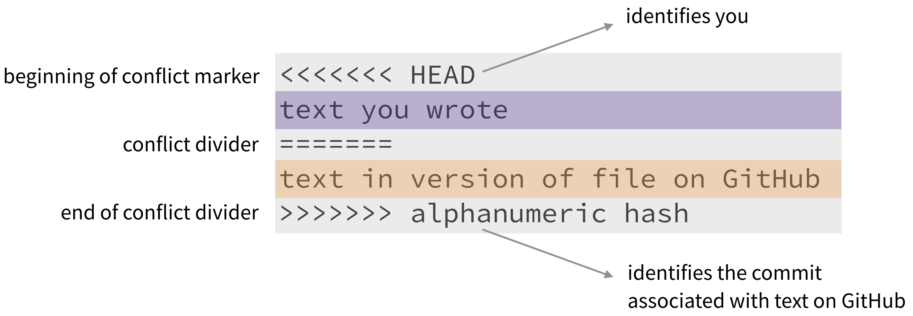

```{r setup, include=FALSE}
# R options
options(
  htmltools.dir.version = FALSE, # for blogdown
  show.signif.stars = FALSE,     # for regression output
  warm = 1
  )
# Set dpi and height for images
library(knitr)
opts_chunk$set(fig.height = 2.65, dpi = 300) 
# ggplot2 color palette with gray
color_palette <- list(gray = "#999999", 
                      salmon = "#E69F00", 
                      lightblue = "#56B4E9", 
                      green = "#009E73", 
                      yellow = "#F0E442", 
                      darkblue = "#0072B2", 
                      red = "#D55E00", 
                      purple = "#CC79A7")
# For nonsese...
library(emo)
htmltools::tagList(rmarkdown::html_dependency_font_awesome())
```

```{r echo=FALSE, message=FALSE, warning=FALSE}
library(tidyverse)
library(rvest)
```

## Agenda

1. Team name
2. What are merge conflicts?
3. Practice dealing with merge conflicts
4. Lab introduction
5. Starting a new project & lab tips

---

## Team Name

.middle[
If you haven't already, please give me your team name by the end of today's lab.
]

---

class: middle, center

## Merge Conflicts
 
---

### What are merge conflicts?

When two collaborators make changes to a file and push the file to their repo, 
git merges these two files.

```{r echo=FALSE, out.width=300, fig.align="center"}
knitr::include_graphics("img/03/merge-no-conflict.png")
```

If these two files have conflicting content on the same line, git will produce a <font class="vocab">merge conflict</font>.

```{r echo=FALSE, out.width=300, fig.align="center"}
knitr::include_graphics("img/03/merge-conflict.png")
```

---

## Resolving merge conflicts

- Merge conflicts need to be resolved manually, as they require a human intervention

```{r echo=FALSE, out.width=800, fig.align="center"}

```

- To resolve the merge conflict
  - decide if you want to keep only your text or the text on GitHub or 
  incorporate changes from both texts
  - delete the conflict markers `<<<<<<<`, `=======`, `>>>>>>>` and make the 
  changes you want in the final merge

---

### Practce dealing with merge conflicts

- Clone the repo starting with **ae-05-** in RStudio Cloud (`ae-05-merge-conflicts-TEAMNAME`), 
and open the R Markdown file.

- Assign the numbers 1, 2, 3, and 4 to each of the team members.
    - If you have 3 team members, make one person **Member 2** and **Member 4**.

- Follow the [application exercise instructions](https://www2.stat.duke.edu/courses/Spring19/sta199.001/appex/02c-merge-conflicts.html) exactly.

- Raise your hand if you have any questions during the exercise. 

- Completing the exercise will be part of the Lab 03 grade.

---

## Tips for collaborating via GitHub

- Always pull first before you start working.

- Knit, commit, and push often to minimize merge conflicts and/or to make merge conflicts easier to resolve.

- If you find yourself in a situation that is difficult to resolve, ask questions asap, don't let it linger and get bigger.

---

## Lab introduction

The next two labs are motivated by
.pull-left[
```{r echo=FALSE, out.width="220px", fig.align="center"}
knitr::include_graphics("img/03/Dennys.png")
```
<br>

```{r echo=FALSE, out.width="220px", fig.align="center"}
knitr::include_graphics("img/03/texas-flag.png")
```
]
.pull-right[
```{r echo=FALSE, out.width="220px", fig.align="center"}

```
<br> 

```{r echo=FALSE, out.width="220px", fig.align="center"}

```    
]

---

## Starting a new project

.small[
- Go to the course GitHub organization and find the **lab-03** repo that has your team name on it.

- On GitHub, click on the green Clone or download button, select Use HTTPS. Click on the clipboard icon to copy the repo URL.

- Go to RStudio Cloud and into the STA199 course workspace. Create a New Project from Git Repo. You will need to click on the down arrow next to the New Project button to see this option.

- Copy and paste the URL of your assignment repo into the dialog box and hit OK.

- Run the following in the console to configure Git: 

```{r eval=FALSE}
library(usethis)
use_git_config(user.name="your name", user.email="your email")
```
]

---

## Tips for Lab

- Each group member should commit and push to GitHub at least once

- All R code chunks should be named. Do not put spaces in the code chunk names.

- Check the .md file on GitHub to make sure it has all of your work, including output and graphs. 
