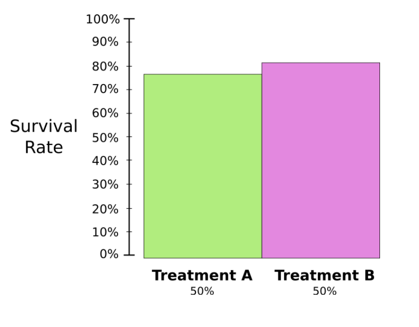
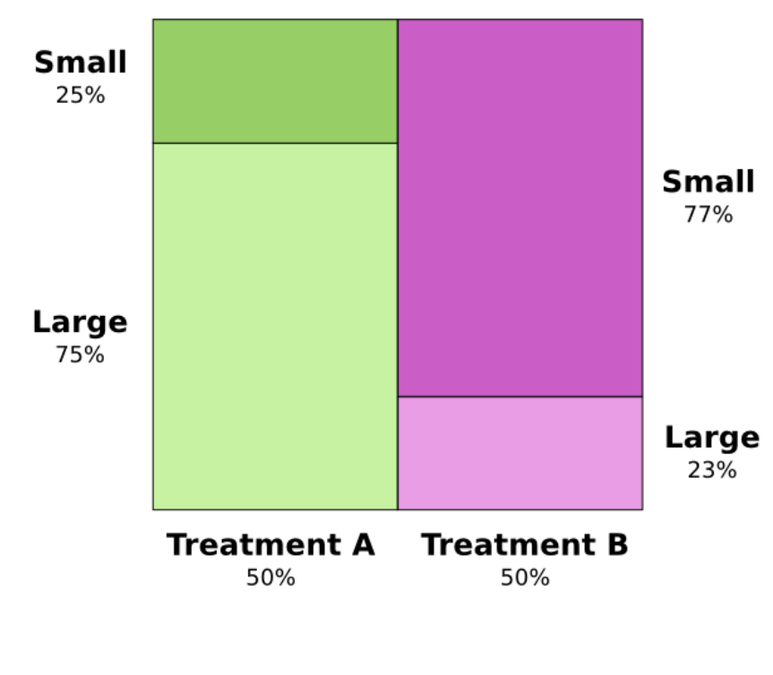
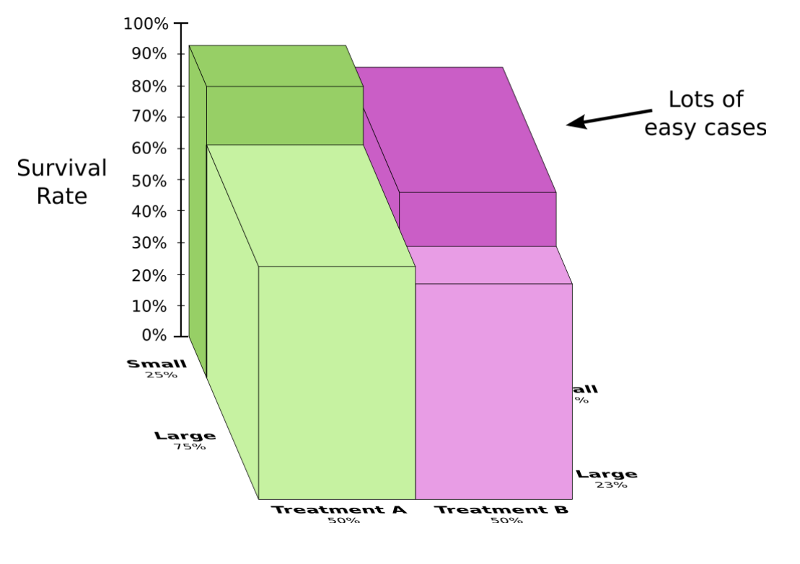

```{r setup, include=FALSE}
# R options
options(
  htmltools.dir.version = FALSE, # for blogdown
  show.signif.stars = FALSE,     # for regression output
  warm = 1
  )
# Set dpi and height for images
library(knitr)
opts_chunk$set(fig.height = 2.65, dpi = 300) 
# ggplot2 color palette with gray
color_palette <- list(gray = "#999999", 
                      salmon = "#E69F00", 
                      lightblue = "#56B4E9", 
                      green = "#009E73", 
                      yellow = "#F0E442", 
                      darkblue = "#0072B2", 
                      red = "#D55E00", 
                      purple = "#CC79A7")
# For nonsese...
library(emo)
htmltools::tagList(rmarkdown::html_dependency_font_awesome())
```

```{r echo=FALSE, message=FALSE, warning=FALSE}
library(tidyverse)
library(rvest)
```

## Agenda

1. Reminder: Exam 01
2. Lab 05: Simpson's Paradox
3. Getting started with lab

---

## Exam 01

- Exam 01 is due tomorrow, Friday 2/15 at 11:59p

- Late work **not** accepted for the exam

- Can answer clarifying questions only **after** lab

---

## Lab 05: Simpson's Paradox

- The paradox occurs when summary statistics appear to disagree with what is occurring at more fine-grained levels in the data

- Particularly misleading in social scientific and medical contexts

---

### Example  

```{r echo=F, echo=FALSE, out.width="80%"}

```
---

### Example Continued

Is it possible that treatment A is the better treatment?

---

### Uneven Grouping

**Small** cases are easier to treat than **Large** cases

```{r echo=F, out.width = '80%'}

```


---

### Frequencies by Groups



---

## Lab 05

- What effect do cigarettes have on the life expectancy in Britain? 

- Does this effect differ by age?

- Write all R code using the style guidelines from [Monday's class notes](https://www2.stat.duke.edu/courses/Spring19/sta199.001/slides/lec-slides/05b-coding-style-data-types.html#1)
    
---

## Getting started with lab

.small[
- Go to the course GitHub organization and find the **lab-04** repo that has your team name on it.

- On GitHub, click on the green Clone or download button, select Use HTTPS. Click on the clipboard icon to copy the repo URL.

- Go to RStudio Cloud and into the STA199 course workspace. Create a New Project from Git repo. You will need to click on the down arrow next to the New Project button to see this option.

- Copy and paste the URL of your assignment repo into the dialog box and hit OK.

- Run the following in the console to configure Git: 

```{r eval=FALSE}
library(usethis)
use_git_config(user.name="your name", user.email="your email")
```
]

---

## Caching your password

You need to cache your password on a per-project basis: 

- Go to the **Terminal** within a project (the most recent lab?)
- Type the following to cache your password for $60 * 60 * 24 * 7 = 604800$ seconds

```{bash eval=FALSE}
git config --global credential.helper 'cache --timeout 604800'
```

You will need to enter your GitHub username and password one more time after caching the password. After that you won't need to enter your credentials for 604800 seconds = 7 days.

