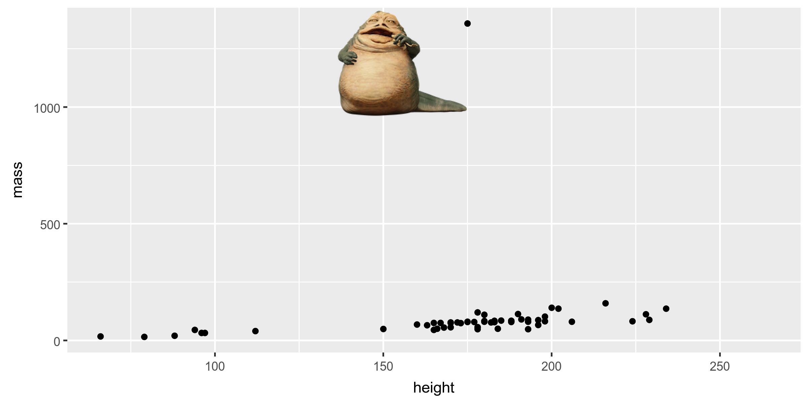

layout: true

<div class="my-footer">
<span>
<a href="http://datasciencebox.org" target="_blank">datasciencebox.org</a>
</span>
</div> 

---

```{r packages, echo=FALSE, message=FALSE, warning=FALSE}
library(emo)
library(tidyverse)
library(fontawesome)
library(magick)
```

## Announcements

- No class or office hours on Monday - Martin Luther King, Jr. Holiday

---

class: center, middle

# Exploratory data analysis

---

## What is EDA?

- .vocab[Exploratory data analysis (EDA)] is an approach to analyzing data sets to summarize the main characteristics.

- Often, EDA is visual. That's what we're focusing on today.

- We can also calculate summary statistics and perform data wrangling/manipulation/transformation at (or before) this stage of the analysis. That's what we're focusing in the next class.

---

class: center, middle

# Data visualization

---

## Data visualization

> *"The simple graph has brought more information to the data analyst’s mind than any other device." — John Tukey*

- .vocab[Data visualization] is the creation and study of the visual representation of data.

- There are many tools for visualizing data (R is one of them), and many approaches/systems within R for making data visualizations
    - **ggplot2** is the one we will use

---

## ggplot2 in tidyverse

.pull-left[

]
.pull-right[
<small>
- **ggplot2** is tidyverse's data visualization package
- The `gg` in "ggplot2" stands for Grammar of Graphics
- It is inspired by the book **Grammar of Graphics** by Leland Wilkinson <sup>†</sup>
- A <u>grammar of graphics</u> is a tool that enables us to concisely describe the components of a graphic
</small>

]

.footnote[ 
<sup>†</sup> Source: [BloggoType](http://bloggotype.blogspot.com/2016/08/holiday-notes2-grammar-of-graphics.html)
]

---

.question[
What **functions** are doing the plotting? What is the **dataset** being plotted? 
Which variable is on the **x-axis**? Which variable is on the **y-axis**? What does 
the **warning** mean?
]

```{r fig.width = 7, fig.height=3.5}
ggplot(data = starwars, mapping = aes(x = height, y = mass)) +
  geom_point() +
  labs(title = "Mass vs. height of Starwars characters",
       x = "Height (cm)", y = "Weight (kg)")
```

---

.question[
What does `geom_smooth()` do? In other words, what changed between the previous plot and this one?
]

```{r fig.width = 7, fig.height=3.5, fig.align='center', warning=FALSE, message=FALSE}
ggplot(data = starwars, mapping = aes(x = height, y = mass)) +
  geom_point() +
  geom_smooth() + #<<
  labs(title = "Mass vs. height of Starwars characters",
       x = "Height (cm)", y = "Weight (kg)")
```

---

## Hello ggplot2!

- `ggplot()` is the main function in ggplot2 and plots are constructed in layers
- The structure of the code for plots can often be summarized as
```{r eval = FALSE}
ggplot + 
  geom_xxx
```

--

or, more precisely
.small[
```{r eval = FALSE}
ggplot(data = [dataset], mapping = aes(x = [x-variable], y = [y-variable])) +
   geom_xxx() +
   other options
```
]

---

## Hello ggplot2!

- To use ggplot2 functions, first load tidyverse
```{r}
library(tidyverse)
```

- For help with the ggplot2, see [ggplot2.tidyverse.org](http://ggplot2.tidyverse.org/)

---

class: center, middle

# Visualizing Star Wars

---

## Dataset terminology

.question[
What does each row represent? What does each column represent?
]


.small[
```{r message=FALSE}
starwars
```
]

---

## Dataset terminology

.small[
```{r message=FALSE}
starwars
```
]

- Each row is an .vocab[observation]
- Each column is a .vocab[variable]
---

## Luke Skywalker


---

## What's in the Star Wars data?

Take a `glimpse` of the data: 
```{r}
glimpse(starwars)
```

---

## What's in the Star Wars data?

.question[
How many rows and columns does this dataset have? What does each row represent? What does each column represent?
]

Run the following **<u>in the Console</u>** to view the help
```{r eval = FALSE}
?starwars
```

```{r echo=FALSE}
knitr::include_graphics("img/02a/starwars-help.png")
```

---

## Mass vs. height

```{r fig.width = 7, fig.height=3.5, fig.align='center'}
ggplot(data = starwars, mapping = aes(x = height, y = mass)) +
  geom_point()
```

---

## What's that warning?

- Not all characters have height and mass information (hence 28 of them not plotted)

```
## Warning: Removed 28 rows containing missing values (geom_point).
```

- Going forward I'll suppress the warning to save space on the slides, but it's important to note it

- To suppress warning: 
.center[
`{r code-chunk-label, warning=FALSE}`
]

---

## Mass vs. height

.question[
How would you describe this **relationship**? What other variables would help us understand data points that don't follow the overall trend? Who is the not so tall but really chubby character?
]

.small[
```{r fig.width = 7, fig.height=3.25, fig.align='center', warning=FALSE}
ggplot(data = starwars, mapping = aes(x = height, y = mass)) +
  geom_point() +
  labs(title = "Mass vs. height of Starwars characters", #<<
       x = "Height (cm)", y = "Weight (kg)")             #<<
```
]

---

## Jabba!

```{r echo=FALSE, fig.align='center', warning=FALSE, message=FALSE}
jabba <- image_read("img/02a/jabba.png")

fig <- image_graph(width = 2400, height = 1200, res = 300)
ggplot(data = starwars, mapping = aes(x = height, y = mass)) +
  geom_point(size = 1.5) + 
  labs(title = "Mass vs. height of Starwars characters",
       x = "Height (cm)", y = "Weight (kg)")
invisible(dev.off())

out <- fig %>% image_composite(jabba, offset = "+1000+30")

image_write(out, "img/02a/jabbaplot.png", format = "png")


```

---

## Additional variables

We can map additional variables to various features of the plot:

- **aesthetics**
    - shape
    - color
    - size
    - alpha (transparency)
    
- **faceting**: small multiples displaying different subsets

---

class: center, middle

# Aesthetics

---

## Aesthetics options

Visual characteristics of plotting characters that can be **mapped to a specific variable**
in the data are

- `color`
- `size`
- `shape`
- `alpha` (transparency)

---

## Mass vs. height + gender

```{r fig.width = 8, fig.height = 4, fig.align='center', warning=FALSE}
ggplot(data = starwars, mapping = aes(x = height, y = mass, color = gender)) +
  geom_point()
```

---

## Mass vs. height + gender

Let's map `shape` and `color` to gender

```{r fig.width = 8, fig.height = 4, fig.align='center', warning=FALSE}
ggplot(data = starwars, mapping = aes(x = height, y = mass, color = gender,
                                      shape = gender #<<
                                      )) +
  geom_point()
```

---

### Mass vs. height + gender + birth year

Let's map the size to birth_year:

```{r fig.width = 8, fig.height = 4 , fig.align = 'center', warning=FALSE}
ggplot(data = starwars, mapping = aes(x = height, y = mass, color = gender, shape = gender, 
                                      size = birth_year #<<
                                      )) +
  geom_point()
```

---

## Mass vs. height + gender 

Let's increase the size of all points **<u>not</u>** based on the values of a 
variable in the data:

```{r fig.width = 8, fig.height=4, fig.align='center' , warning=FALSE}
ggplot(data = starwars, mapping = aes(x = height, y = mass, color = gender)) +
  geom_point(size = 3) #<<
```

---

## Aesthetics summary

- Continuous variable are measured on a continuous scale
- Discrete variables are measured (or often counted) on a discrete scale

.small[
aesthetics    | discrete                 | continuous
------------- | ------------------------ | ------------
color         | rainbow of colors        | gradient
size          | discrete steps           | linear mapping between radius and value
shape         | different shape for each | shouldn't (and doesn't) work

]

- Use aesthetics (`aes`) for mapping features of a plot to a variable, define the 
features in the `geom_xxx` for customization **<u>not</u>** mapped to a variable

---

class: center, middle

# Faceting

---

## Faceting options

- Smaller plots that display different subsets of the data
- Useful for exploring conditional relationships and large data

.small[
```{r fig.height=3, fig.width=6, fig.align='center', warning=FALSE}
ggplot(data = starwars, mapping = aes(x = height, y = mass)) +
  facet_grid(. ~ gender) + #<<
  geom_point() +
  labs(title = "Mass vs. height of Starwars characters",
       subtitle = "Faceted by gender",  #<<
       x = "Height (cm)", y = "Weight (kg)")
```
]

---

## Dive further...

.question[
In the next few slides describe what each plot displays. Think about
how the code relates to the output.
]

--

<br><br><br>

.alert[
The plots in the next few slides do not have proper titles, axis labels, etc. 
because we want you to figure out what's happening in the plots. But you 
should always label your plots!
]

---

```{r fig.height=6, fig.width=7, fig.align='center', warning=FALSE}
ggplot(data = starwars, mapping = aes(x = height, y = mass)) +
  geom_point() +
  facet_grid(gender ~ .)
```

---

```{r fig.height=6,fig.width=7,fig.align='center', warning=FALSE}
ggplot(data = starwars, mapping = aes(x = height, y = mass)) +
  geom_point() +
  facet_grid(. ~ gender)
```

---

```{r fig.height=6, fig.width=9, warning=FALSE}
ggplot(data = starwars, mapping = aes(x = height, y = mass)) +
  geom_point() +
  facet_wrap(~ eye_color)
```

---

## Facet summary

- `facet_grid()`: 
    - 2d grid
    - `rows ~ cols`
    - use `.` for no split

--

- `facet_wrap()`: 1d ribbon wrapped into 2d

---

## Starwars Application Exercise

- Go to [https://github.com/STA199-Sp19](https://github.com/STA199-Sp19)

- Click on the repo that begins with `ae-03-starwars-`. 

- Click on **README.md** to see the instructions for this exercise. 

--

- You will work in groups of 2 - 3 for the remainder of the exercise. One team member will go through the steps on their computer. The other team member(s) will follow along and read the instructions aloud from the README file.

---

class: center, middle

# Identifying variables

---

## Number of variables involved

- .vocab[Univariate data analysis]: distribution of single variable

- .vocab[Bivariate data analysis]: relationship between two variables

- .vocab[Multivariate data analysis]: relationship between many variables at once, usually focusing on the relationship between two while conditioning for others

---

## Types of variables

- .vocab[Numerical variables] can be classified as .vocab[continuous] or .vocab[discrete] based on whether or not the variable can take on an infinite number of values or only non-negative whole numbers, respectively.
    - *height* is continuous
    - *number of siblings* is discrete

--

- If the variable is .vocab[categorical], we can determine if it is .vocab[ordinal] based on whether or not the levels have a natural ordering.
    - *hair color* is unordered 
    - *year in school* is ordinal

---

class: center, middle

# Visualizing numerical data

---

### Describing shapes of numerical distributions

- **shape:**
    - skewness: right-skewed, left-skewed, symmetric (skew is to the side of the longer tail)
    - modality: unimodal, bimodal, multimodal, uniform
    
- **center:** mean (`mean`), median (`median`), mode (not always useful)

- **spread:** range (`range`), standard deviation (`sd`), inter-quartile range (`IQR`)

- **outliers**: observations outside of the usual pattern

---

## Histograms

.small[
```{r fig.width = 7, fig.height = 4, fig.align='center'}
ggplot(data = starwars, mapping = aes(x = height)) +
  geom_histogram(binwidth = 10)
```
]

---

## Density plots

.small[
```{r fig.width = 7, fig.height=4, fig.align='center'}
ggplot(data = starwars, mapping = aes(x = height)) +
  geom_density()
```
]

---

## Side-by-side box plots

.small[
```{r fig.width = 7, fig.height=4, fig.align='center'}
ggplot(data = starwars, mapping = aes(y = height, x = gender)) +
  geom_boxplot()
```
]

---

class: center, middle

# Visualizing categorical data

---

## Bar plots

.small[
```{r fig.width = 7, fig.height=4, fig.align='center'}
ggplot(data = starwars, mapping = aes(x = gender)) +
  geom_bar()
```
]

---

### Segmented bar plots, counts

.small[
```{r fig.width = 7, fig.height=4, fig.align='center'}
ggplot(data = starwars, mapping = aes(x = gender, fill = hair_color)) +
  geom_bar()
```
]

---

### Segmented bar plots, proportions

.small[
```{r fig.width = 7, fig.height=4, fig.align='center'}
ggplot(data = starwars, mapping = aes(x = gender, fill = hair_color)) +
  geom_bar(position = "fill") + #<<
  labs(y = "proportion")
```
]

---

### Which bar plot is more appropriate?

.question[
Which bar plot is a more useful representation for visualizing the relationship between gender and hair color? Why?
]

```{r, include=FALSE, eval=FALSE}
starwars <- starwars %>%
  mutate(hair_color2 = fct_other(hair_color, 
                                 keep = c("black", "brown", "brown", "blond")))
```


```{r echo=FALSE, fig.height=1.4, fig.width=6, include=FALSE, eval = FALSE}
ggplot(data = starwars, mapping = aes(x = gender, fill = hair_color2)) +
  geom_bar()
ggplot(data = starwars, mapping = aes(x = gender, fill = hair_color2)) +
  geom_bar(position = "fill") +
  labs(y = "proportion")
```

---

## Before next class

- Make sure you are in the STA199-Sp19 organization and can see the `ae-03-starwars` repo!

- Start Reading 01 posted on the course schedule - due Wed Jan 23

- If you have not already done so, 
    - complete "Getting to know you" survey on Sakai 
    - complete Pretest ([test info & access codes](https://www2.stat.duke.edu/courses/Spring19/sta199.001/slides/lab-slides/00-lab-slides.html#9))
    