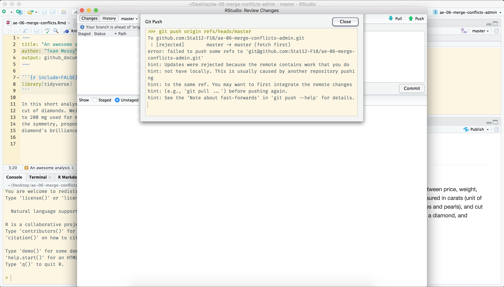
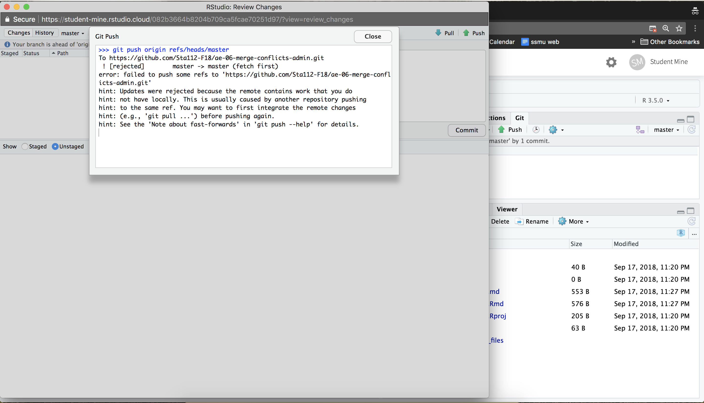
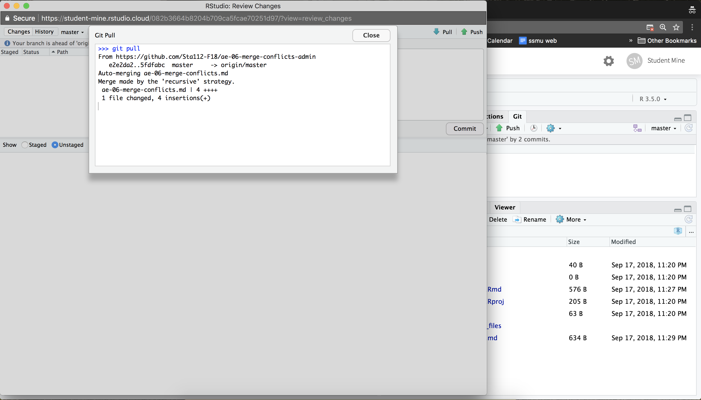

layout: true

<div class="my-footer">
<span>
<a href="http://datasciencebox.org" target="_blank">datasciencebox.org</a>
</span>
</div> 

---

```{r setup, include=FALSE}
knitr::opts_chunk$set(echo = TRUE,
                      dpi=300,
                      fig.height = 3,
                      fig.width = 5
)
```

```{r packages, echo=FALSE, message=FALSE, warning=FALSE}
library(emo)
library(tidyverse)
library(fontawesome)
library(magick)
library(dsbox)
```

class: middle, center

## What is a merge conflict?

---

## Merge conflicts

When two collaborators make changes to a file and push the file to their repo, 
git merges these two files.

```{r echo=FALSE, out.width=300, fig.align="center"}
knitr::include_graphics("img/02c/merge-no-conflict.png")
```

--

If these two files have conflicting content on the same line, git will produce a <font class="vocab">merge conflict</font>.

```{r echo=FALSE, out.width=300, fig.align="center"}
knitr::include_graphics("img/02c/merge-conflict.png")
```

---

## Resolving merge conflicts

- Merge conflicts need to be resolved manually, as they require a human intervention

```{r echo=FALSE, out.width=800, fig.align="center"}
knitr::include_graphics("img/02c/merge-conflict-identifiers.png")
```

- To resolve the merge conflict
  - decide if you want to keep only your text or the text on GitHub or 
  incorporate changes from both texts
  - delete the conflict markers `<<<<<<<`, `=======`, `>>>>>>>` and make the 
  changes you want in the final merge

---

class: center, middle

# Application exercise

---

## AE 05 - Merge Conflicts 

**Sit with your team**

**Once you're with your team:**

- Clone your assignment repo in RStudio Cloud (`ae-05-merge-conflicts-TEAMNAME`), 
and open the R Markdown file.

- Assign the numbers 1, 2, 3, and 4 to each of the team members.
    - If you have 3 team members, make one person **Member 2** and **Member 4**.

- Follow the [application exercise instructions](https://www2.stat.duke.edu/courses/Spring19/sta199.001/appex/02c-merge-conflicts.html) exactly.

---

class: center, middle

# Review

---

.question[
What does the following message mean?
]

<br>

```{r echo=FALSE, out.width=800, fig.align="center"}

```

---

.question[
What does the following message mean?
]

<br>

```{r echo=FALSE, out.width=800, fig.align="center"}
knitr::include_graphics("img/02c/merge-failed.png")
```

---

.question[
What does the following message mean?
]

<br>

```{r echo=FALSE, out.width=800, fig.align="center"}

```

---

.question[
What does the following message mean?
]

<br>

```{r echo=FALSE, out.width=800, fig.align="center"}

```

---

## Tips for collaborating via GitHub

- Always pull first before you start working.
- Commit, and push, often to minimize merge conflicts and/or to make merge conflicts easier to resolve.
- If you find yourself in a situation that is difficult to resolve, ask questions asap, don't let it linger and get bigger.

---

## Before next class

- Sit with your team on Wednesday 


