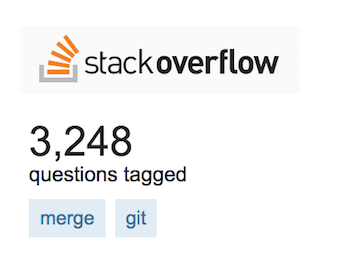
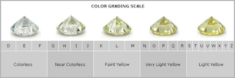
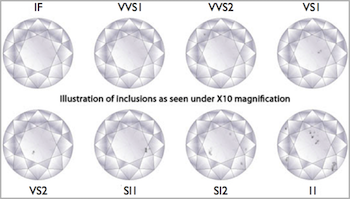

layout: true

<div class="my-footer">
<span>
<a href="http://datasciencebox.org" target="_blank">datasciencebox.org</a>
</span>
</div> 

---

```{r setup, include=FALSE}
knitr::opts_chunk$set(echo = TRUE,
                      warning=FALSE,
                      message=FALSE,
                      fig.height = 2.65, 
                      dpi = 300) 
```

```{r, echo=FALSE}
library(tidyverse)
```


## Announcements

- Lab 03 due today!
    - Make sure .md file is updated on GitHub

- Reading 02 due Wed, Feb 06

- HW 02 due Mon, Feb 11

---

class: center, middle

# R/RStudio

---

# R/RStudio

- **R**: statistical programming language

- **RStudio**: integrated development environment for the R language

- **RStudio Cloud** allows us to use RStudio without local installation (which can be hairy)
  - Interested in learning about other ways of using RStudio -- come by office hours
  - Already have another way of using RStudio -- make sure to maintain Cloud account for in-class exercises
  
---

# R packages

- R is an open source language

- Packages developed by open source developers

---

class: center, middle

# Git/GitHub

---

## Merge conflicts

.pull-left[
Confused about merge conflicts? Most people are...
]
.pull-right[

]

--

- Why does a merge conflict happen?

--

- What questions do you have?

---

### Tips for collaborating via Git/GitHub

- Always pull first before you start working.

- Knit, commit, and push often to minimize merge conflicts and/or to make merge conflicts easier to resolve.

- Push **all** documents so everything is up-to-date on GitHub.

- If you find yourself in a situation that is difficult to resolve, ask questions asap, don't let it linger and get bigger.

---

class: middle, center

## Visualizing Star Wars

---

## Starting point

```{r}
starwars <- starwars %>%
  filter(mass < 500)

ggplot(data = starwars, aes(x = height, y = mass, color = gender)) +
  geom_point()
```

---

## Add title

```{r}
ggplot(data = starwars, aes(x = height, y = mass, color = gender)) +
  geom_point() +
  labs(title = "Mass vs. height of Star Wars characters") #<<
```

---

## Add x and y labels

```{r}
ggplot(data = starwars, aes(x = height, y = mass, color = gender)) +
  geom_point() +
  labs(title = "Mass vs. height of Star Wars characters",
       x = "Height (in cm)", y = "Mass (in kg)") #<<
```

---

## Change legend label

```{r}
ggplot(data = starwars, aes(x = height, y = mass, color = gender)) +
  geom_point() +
  labs(title = "Mass vs. height of Star Wars characters",
       x = "Height (in cm)", y = "Mass (in kg)", color = "Gender") #<<
```

---

## Change zooming

```{r}
ggplot(data = starwars, aes(x = height, y = mass, color = gender)) +
  geom_point() +
  labs(title = "Mass vs. height of Star Wars characters",
       x = "Height (in cm)", y = "Mass (in kg)", color = "Gender") +
  xlim(c(100, 200)) + #<<
  ylim(c(40, 120)) #<<
```

---

## Change transparency

```{r}
ggplot(data = starwars, aes(x = height, y = mass, color = gender)) +
  geom_point(alpha = 0.3) + #<<
  labs(title = "Mass vs. height of Star Wars characters",
       x = "Height (in cm)", y = "Mass (in kg)", color = "Gender")
```

---

## Change theme - `theme_dark()`

```{r}
ggplot(data = starwars, aes(x = height, y = mass, color = gender)) +
  geom_point() +
  labs(title = "Mass vs. height of Star Wars characters",
       x = "Height (in cm)", y = "Mass (in kg)", color = "Gender") +
  theme_dark() #<<
```

---

## 538 theme

```{r}
library(ggthemes)

ggplot(data = starwars, aes(x = height, y = mass, color = gender)) +
  geom_point() +
  labs(title = "Mass vs. height of Star Wars characters",
       x = "Height (in cm)", y = "Mass (in kg)", color = "Gender") +
  theme_fivethirtyeight() #<<
```

---

## Further customization

- It is possible to do a lot more customization to your plots

- See http://ggplot2.tidyverse.org/ for help on using the ggplot2 package
    - You can find a list of all ggplot2 functions in the Reference tab of the package homepage
    
- Sometimes customization is valuable. Other times, the defaults work well and further customization is not needed.

---

class: center, middle

# Wrangling diamonds data

Follow along on RStudio Cloud: Review - Diamonds 
---

## The data

Diamond prices are driven by 4Cs: carat, cut, color, and clarity. We'll explore a dataset containing the prices and other attributes of almost 54,000 diamonds from the tidyverse package.

View the codebook: 

```{r eval=FALSE}
?diamonds
```

or at [http://ggplot2.tidyverse.org/reference/diamonds.html](http://ggplot2.tidyverse.org/reference/diamonds.html)

---

## 4Cs of diamonds

- **Carat**: unit of mass equal to 200 mg used for measuring gemstones and pearls 

- **Cut**: objective measure of a diamond's light performance / sparkle

- **Color**:

```{r echo=FALSE, out.width = '40%', fig.align='center'}

```

- **Clarity**:

```{r echo=FALSE, out.width = '40%', fig.align='center'}

```

---

## Measurements

.center[

]

---

## Price

What type of variable is price? Would you expect its distribution to be symmetric, right-skewed, or left-skewed? Why? Make a histogram of the distribution of diamond prices. Does the shape of the distribution match your expectation?

```{r}

```

---

## Cut

How many diamonds of each type of cut are there?

```{r}

```

---

## Clarity

Calculate the relative frequency (proportion) of each clarity of diamonds.

```{r}

```

---

## Clarity by cut

Calculate the relative frequency of each clarity of diamonds by cut.

```{r}

```

---

## Depth and price

Plot the relationship between depth and price of only fair cut diamonds.

```{r}

```


---

## Cut and price

For each type of cut, calculate minimum (`min`), maximum (`max`), mean (`mean`), and median (`median`) price of diamonds of that type.

```{r}

```

---

## Recap

- Start with data frame

- Pipe into a function (verb)

- Only print output if counting, summarizing, etc.

- Save output as the original data frame (or something else) if you want to use the updated data frame later in the analysis