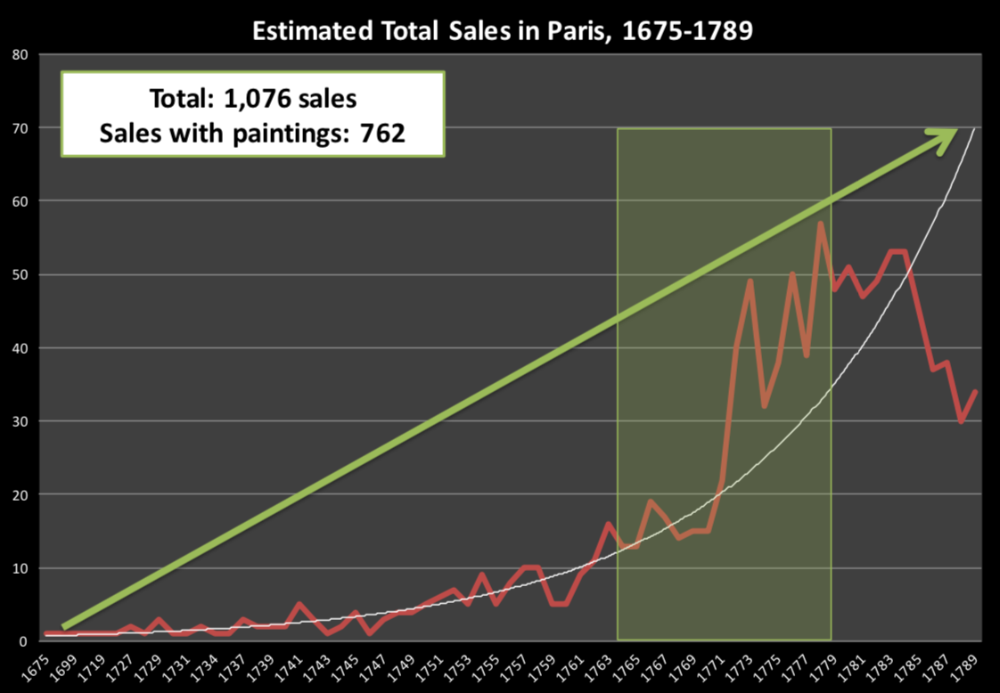
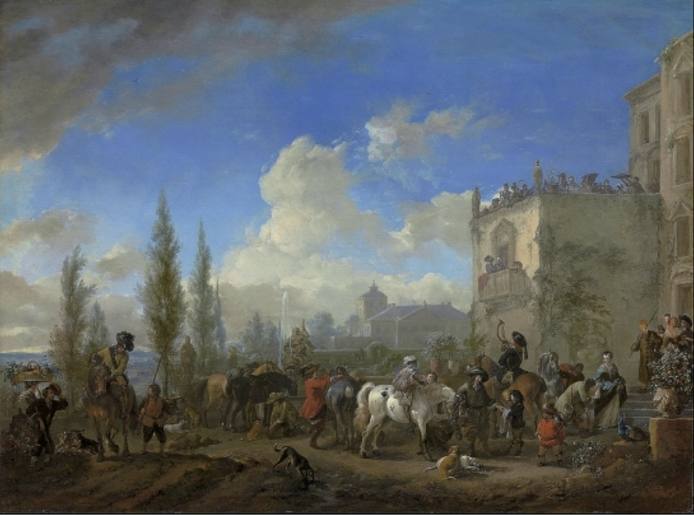

layout: true

<div class="my-footer">
<span>
<a href="http://datasciencebox.org" target="_blank">datasciencebox.org</a>
</span>
</div> 

---

```{r packages, echo=FALSE, message=FALSE, warning=FALSE}
library(tidyverse)
library(knitr)
library(emo)
library(DT)
```

```{r setup, include=FALSE}
knitr::opts_chunk$set(echo = TRUE,
                      warning=FALSE,
                      message=FALSE,
                      fig.height = 2.65, 
                      dpi = 300) 
# For nonsese...
htmltools::tagList(rmarkdown::html_dependency_font_awesome())
# For magick
dev.off <- function(){
  invisible(grDevices::dev.off())
}
```


## Announcements

- Lab 05 due tonight at 11:59p

---

class: middle, center

## The language of models

---

## Modeling

- Use models to explain the relationship between variables and to make predictions

- For now we focus on **linear** models (but remember there are other types of models too!)

---

class: center, middle

# Packages

---

## Packages

.pull-left[


]
.pull-right[
- You're familiar with the tidyverse:
```{r message=FALSE}
library(tidyverse)
```

- The broom package takes the messy output of built-in functions in R, such as `lm`, and turns them into tidy data frames.
```{r message=FALSE}
library(broom)
```
]

---

class: center, middle

# Data: Paris Paintings

---

## Paris Paintings

```{r message=FALSE}
pp <- read_csv("data/paris_paintings.csv", na = c("n/a", "", "NA"))
```

.question[
What does the `data/` mean in the code above? Hint: Where is the data file located?
]

- [Paris Paintings Codebook](https://www2.stat.duke.edu/courses/Fall15/sta112.01/data/paris_paintings.html)
---

## Meet the data curators

.center[
 

Sandra van Ginhoven &nbsp; &nbsp; Hilary Coe Cronheim

PhD students in the Duke Art, Law, and Markets Initiative in 2013
]

- Source: Printed catalogues of 28 auction sales in Paris, 1764- 1780
- 3,393 paintings, their prices, and descriptive details from sales catalogues over 60 variables

---

## Auctions today


[https://www.youtube.com/watch?v=apaE1Q7r4so](https://www.youtube.com/watch?v=apaE1Q7r4so)

---

## Auctions back in the day


Pierre-Antoine de Machy, Public Sale at the Hôtel Bullion, Musée Carnavalet, Paris (18th century)

---

## Paris auction market



---

## Depart pour la chasse



---

## Auction catalogue text

.pull-left[


]
.pull-right[
.small[
Two paintings very rich in composition, of a beautiful execution, and whose merit is very remarkable, each 17 inches 3 lines high, 23 inches wide; the first, painted on wood, comes from the Cabinet of Madame la Comtesse de Verrue; it represents a departure for the hunt: it shows in the front a child on a white horse, a man who gives the horn to gather the dogs, a falconer and other figures nicely distributed across the width of the painting; two horses drinking from a fountain; on the right in the corner a lovely country house topped by a terrace, on which people are at the table, others who play instruments; trees and fabriques pleasantly enrich the background.
]
]

---

```{r}
pp %>% filter(name == "R1777-89a") %>% 
  select(name:endbuyer) %>% t()
```

---

```{r}
pp %>% filter(name == "R1777-89a") %>% 
  select(Interm:finished) %>% t()
```

---

```{r}
pp %>% filter(name == "R1777-89a") %>% 
  select(lrgfont:other) %>% t()
```

---

class: center, middle

## Modeling the relationship between variables

---

## Prices

.question[
Describe the distribution of prices of paintings.
]

```{r, fig.height=2.5}
ggplot(data = pp, aes(x = price)) +
  geom_histogram(binwidth = 1000) +
  labs(title="Distribution of Price (in Livres)")
```

---

## Height

```{r, fig.height=2.5}
ggplot(data = pp, aes(x = Height_in)) +
  geom_histogram()
```

---

## Width

```{r, fig.height=2.5}
ggplot(data = pp, aes(x = Width_in)) +
  geom_histogram()
```

---

## Models as functions

- We can represent relationships between variables using **functions**

- A <font class="vocab">function</font> is a mathematical concept: the relationship between an output and one or more inputs. 
    - Plug in the inputs and receive back the output
    
--

- Example: the formula $y = 3x + 7$ is a function with input $x$ and output $y$,
    when $x$ is $5$, the output $y$ is $22$
    
    ```
    y = 3 * 5 + 7 = 22
    ```

---

## Height as a function of width

.question[
Describe the relationship between height and width of paintings.
]

```{r warning = FALSE, echo=FALSE}
ggplot(data = pp, aes(x = Width_in, y = Height_in)) +
  geom_point() +
  geom_smooth(method = "lm") # lm for linear model
```

---

## Visualizing the linear model

```{r warning = FALSE}
ggplot(data = pp, aes(x = Width_in, y = Height_in)) +
  geom_point() +
  geom_smooth(method = "lm") # lm for linear model
```

---

## Visualizing the linear model

... without the measure of uncertainty around the line

```{r warning = FALSE, fig.height=2.25, fig.width=5}
ggplot(data = pp, aes(x = Width_in, y = Height_in)) +
  geom_point() +
  geom_smooth(method = "lm", se = FALSE) # lm for linear model
```

---

## Visualizing the linear model

... with different cosmetic choices for the line

```{r warning = FALSE, fig.height=2.25, fig.width=5}
ggplot(data = pp, aes(x = Width_in, y = Height_in)) +
  geom_point() +
  geom_smooth(method = "lm", se = FALSE, 
              # color       #line type  #line weight 
              col = "pink", lty = 2,   lwd = 3) 
```

---

## Vocabulary

- <font class="vocab">Response variable:</font> Variable whose behavior or variation you are trying to understand, on the y-axis (dependent variable)

--

- <font class="vocab">Explanatory variables:</font> Other variables that you want to use to explain the variation in the response, on the x-axis (independent variables)

--

- <font class="vocab">Predicted value:</font> Output of the **model function**
    - The model function gives the typical value of the response variable
    *conditioning* on the explanatory variables

--

- <font class="vocab">Residuals:</font> Show how far each case is from its model value
    - **Residual = Observed value - Predicted value**
    - Tells how far above/below the model function each case is

---

## Residuals

.question[
What does a negative residual mean? Which paintings on the plot have have negative 
residuals, those below or above the line?
]

```{r warning = FALSE, echo=FALSE}
ggplot(data = pp, aes(x = Width_in, y = Height_in)) +
  geom_point() +
  geom_smooth(method = "lm", se = FALSE)
```

---

.question[
The plot below displays the relationship between height and width of paintings. It  uses a lower alpha level for the points than the previous plots we looked at. What feature is apparent in this plot that was not (as) apparent in the previous plots? What might be the reason for this feature?
]

```{r warning = FALSE, echo=FALSE}
ggplot(data = pp, aes(x = Width_in, y = Height_in)) +
  geom_point(alpha = 0.2)
```

---

## Landscape paintings

- **Landscape painting** is the depiction in art of landscapes – natural scenery such as mountains, valleys, trees, rivers, and forests, especially where the main subject is a wide view – with its elements arranged into a coherent composition.<sup>1</sup>
    - Landscape paintings tend to be wider than longer.

- **Portrait painting** is a genre in painting, where the intent is to depict a human subject.<sup>2</sup>
    - Portrait paintings tend to be longer than wider.

.footnote[
[1] Source: Wikipedia, [Landscape painting](https://en.wikipedia.org/wiki/Landscape_painting)

[2] Source: Wikipedia, [Portait painting](https://en.wikipedia.org/wiki/Portrait_painting)
]

---

## Multiple explanatory variables

.question[
How, if at all, the relationship between width and height of paintings vary by whether
or not they have any landscape elements?
]
.small[
```{r warning = FALSE, fig.height=2}
ggplot(data = pp, aes(x = Width_in, y = Height_in, 
                      color = factor(landsALL))) +
  geom_point(alpha = 0.4) +
  geom_smooth(method = "lm", se = FALSE) +
  labs(color = "landscape")
```
]
---

## Models - upsides and downsides

- Models can sometimes reveal patterns that are not evident in a graph of the
data. This is a great advantage of modelling over simple visual inspection of
data. 

- There is a real risk, however, that a model is imposing structure that is
not really there on the scatter of data, just as people imagine animal shapes in
the stars. A skeptical approach is always warranted.

---

## Variation around the model...

is just as important as the model, if not more!

.alert[
*Statistics is the explanation of variation in the context of what remains
unexplained.*
]

- The scatter suggests that there might be other factors that account for large parts 
of painting-to-painting variability, or perhaps just that randomness plays a big role.

- Adding more explanatory variables to a model can sometimes usefully reduce
the size of the scatter around the model. (We'll talk more about this later.)

---

## How do we use models?

1. **Explanation**: Characterize the relationship between $y$ and $x$ via *slopes* for
numerical explanatory variables or *differences* for categorical explanatory
variables

2. **Prediction**: Plug in $x$, get the predicted $y$

---

class: middle, center

## Interpreting Models

---

## Want to follow along?

Go to RStudio Cloud -> make a copy of "Modeling Paris Paintings"

---

## Height & width

```{r}
m_ht_wt <- lm(Height_in ~ Width_in, data = pp)
tidy(m_ht_wt)
```

--

$$\widehat{Height_{in}} = 3.62 + 0.78~Width_{in}$$

--

- <font class="vocab">Slope:</font> For each additional inch the painting is wider, the height is expected
to be higher, on average, by 0.78 inches.

--

- <font class="vocab">Intercept:</font> Paintings that are 0 inches wide are expected to be 3.62 inches high,
on average.
    - Does this make sense?
    
---

## broom 

.pull-left[
.middle[

]
]

.pull-right[
- **broom** follows tidyverse principles and tidies up regression output
- **`tidy`**: Constructs a tidy data frame summarizing model's statistical findings
- **`glance`**: Constructs a concise one-row summary of the model
- **`augment`**: Adds columns (e.g. predictions, residuals) to the original data that was modeled
]

[https://broom.tidyverse.org/](https://broom.tidyverse.org/)
---

### The linear model with a single predictor

- We're interested in the $\beta_0$ (population parameter for the intercept)
and the $\beta_1$ (population parameter for the slope) in the 
following model:

$$ \hat{y} = \beta_0 + \beta_1~x $$

--

- Unfortunately, we can't get these values

--

- So we use the sample statistics to estimate them:

$$ \hat{y} = b_0 + b_1~x $$

---

## Least squares regression

The regression line minimizes the sum of squared residuals.

--

- <font class="vocab">Residuals: </font> $e_i = y - \hat{y}$,


- The regression line minimizes $\sum_{i = 1}^n e_i^2$.

---

## Visualizing residuals

```{r echo=FALSE, fig.height=4}
d <- tibble(
    Width_in     = m_ht_wt$model$Width_in,
    Height_in    = m_ht_wt$model$Height_in,
    pred         = m_ht_wt$fitted.values,
    res          = m_ht_wt$residuals
  )
p <- ggplot(data = d, mapping = aes(x = Width_in, y = Height_in)) +
  geom_point(alpha = 0.2) + 
  theme_bw() +
  labs(title = "Height vs. width of paintings", subtitle = "Just the data") +
  xlim(0, 250) +
  ylim(0, 200)
p
```

---

## Visualizing residuals (cont.)

```{r echo=FALSE, fig.height=4}
p <- p + 
  geom_smooth(method = "lm", se = FALSE) +
  geom_point(mapping = aes(y = pred)) +
  labs(subtitle = "Data + least squares resgression line")
p
```

---

## Visualizing residuals (cont.)

```{r echo = FALSE, fig.height=4}
p + 
  geom_segment(mapping = aes(xend = Width_in, yend = pred), alpha = 0.4, color="red") +
  labs(subtitle = "Data + least squares resgression line + residuals")
```


---

### Properties of the least squares regression line

- The slope has the same sign as the correlation coefficient:

$$b_1 = r \frac{s_y}{s_x}$$

- The regression line goes through the center of mass point, the coordinates corresponding to average $x$ and average $y$: $(\bar{x}, \bar{y})$.

$$\hat{y} = b_0 + b_1 x \hspace{5mm} ~ \Rightarrow  \hspace{5mm}~ b_0 = \bar{y} - b_1 \bar{x}$$


- The sum of the residuals is zero: 

$$\sum_{i = 1}^n e_i = 0$$

- The residuals and $x$ values are uncorrelated.

---

## Height & landscape features

```{r}
m_ht_lands <- lm(Height_in ~ factor(landsALL), data = pp)
tidy(m_ht_lands)
```

--

<br>

$$\widehat{Height_{in}} = 22.68 - 5.65~landsALL$$

---

## Height & landscape features (cont.)

- **Slope:** Paintings with landscape features are expected, on average,
to be 5.65 inches shorter than paintings that without landscape features.
    - Compares baseline level (`landsALL = 0`) to other level
    (`landsALL = 1`).

- **Intercept:** Paintings that don't have landscape features are expected, on 
average, to be 22.68 inches tall.

---

### Categorical predictor with 2 levels

```{r echo=FALSE}
pp %>% 
  select(name, price, landsALL) %>% 
  slice(1:8)
```

---

### Relationship between height and school

```{r}
m_ht_sch <- lm(Height_in ~ school_pntg, data = pp)
tidy(m_ht_sch)
```

--

- When the categorical explanatory variable has many levels, the levels are encoded to <font class="vocab">dummy variables</font>

- Each coefficient describes the expected difference between heights in that 
particular school compared to the baseline level.

---

## Categorical predictor with >2 levels

.small[
```{r echo=FALSE}
pp %>% 
  select(school_pntg) %>% 
  group_by(school_pntg) %>% 
  sample_n(1) %>%
  mutate(
    D_FL = as.integer(ifelse(school_pntg == "D/FL", 1L, 0)),
    F    = as.integer(ifelse(school_pntg == "F", 1L, 0)),
    G    = as.integer(ifelse(school_pntg == "G", 1L, 0)),
    I    = as.integer(ifelse(school_pntg == "I", 1L, 0)),
    S    = as.integer(ifelse(school_pntg == "S", 1L, 0)),
    X    = as.integer(ifelse(school_pntg == "X", 1L, 0))
  )
```
]

---

### The linear model with multiple predictors

- Population model:

$$ \hat{y} = \beta_0 + \beta_1~x_1 + \beta_2~x_2 + \cdots + \beta_k~x_k $$

--

- Sample model that we use to estimate the population model:
  
$$ \hat{y} = b_0 + b_1~x_1 + b_2~x_2 + \cdots + b_k~x_k $$

---

### Correlation does not imply causation!

Remember this when interpreting model coefficients
