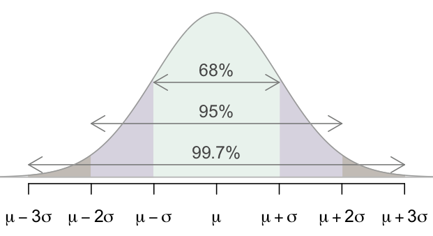

layout: true

<div class="my-footer">
<span>
<a href="http://datasciencebox.org" target="_blank">datasciencebox.org</a>
</span>
</div> 

```{r packages, echo=FALSE, message=FALSE, warning=FALSE}
library(tidyverse)
library(broom)
library(knitr)
library(DT)
library(emo)
library(openintro)
library(infer)
library(gridExtra)
```


```{r setup, include=FALSE}
# R options
options(
  htmltools.dir.version = FALSE, # for blogdown
  show.signif.stars = FALSE,     # for regression output
  warm = 1
  )
# Set dpi and height for images
knitr::opts_chunk$set(fig.height = 2.5, fig.width = 5, 
                      dpi = 300, 
                      warning = FALSE, 
                      message = FALSE) 
# ggplot2 color palette with gray
color_palette <- list(gray = "#999999", 
                      salmon = "#E69F00", 
                      lightblue = "#56B4E9", 
                      green = "#009E73", 
                      yellow = "#F0E442", 
                      darkblue = "#0072B2", 
                      red = "#D55E00", 
                      purple = "#CC79A7")
htmltools::tagList(rmarkdown::html_dependency_font_awesome())
# For magick
dev.off <- function(){
  invisible(grDevices::dev.off())
}
# For ggplot2
ggplot2::theme_set(ggplot2::theme_bw())
```

---

## Announcements

- HW 04 due **today** at 11:59p

- Writing peer review due Thur at 11:59p (will have some time in lab)

- Project proposal due **Friday** at 11:59p - questions?

- Midterm assigned on Monday, due Friday at 11:59p
    - Mostly modeling + inference
    - Some exploratory data analysis
    
---

## Midsemester survey 

- Labs

- Due dates

- Learn by doing! 80% said working on assignments contributed most to their learning

---

## HW 04 Question 1

.question[
Describe the simulation process for testing for a single population standard deviation. Suppose the research question is asking whether the standard deviation is less than 3, and the observed sample standard deviation is 2.
]

--

1. How many variables?

--

2. What types of variable(s)?

--

3. What is the research question?

--

4. What are the null and alternative hypothesis?

--

5. What example in the notes can help me solve this question?

---

class: center, middle

## Sample Statistics and Sampling Distributions

---

## Notation

- **<u>Means</u>**:
    - **Population**: mean = $\mu$, standard deviation = $\sigma$
    - **Sample**: mean = $\bar{x}$, standard deviation = $s$

<br> 

- **<u>Proportions</u>**:
    - **Population**: $p$
    - **Sample**: $\hat{p}$
    
<br>

- **Standard error**: $SE$

---

## Variability of sample statistics

- Each sample from the population yields a slightly different sample statistic 
(sample mean, sample proportion, etc.)

- The variability of these sample statistics is measured by the <font class="vocab">standard error</font>

- Previously we quantified this value via simulation

- Today we talk about the theory underlying **sampling distributions**

---

## Sampling distribution

- <font class="vocab">Sampling distribution</font> is the distribution of sample statistics of random
samples of size $n$ taken with replacement from a population

- In practice it is impossible to construct sampling distributions since it would 
require having access to the entire population

- Today for demonstration purposes we will assume we have access to the population
data, and construct sampling distributions, and examine their shapes, centers, and
spreads

.question[
What is the difference between the sampling distribution and bootstrap distribution?
]

---

## The sampling distribution

.question[
We have a population that is normally distributed with mean 20 and standard deviation 3. Suppose we take samples of size 50 from this distribution, and plot their sample means. What shape, center, and spread will this distribution have?
]

---

## The population

```{r}
set.seed(03272019)
norm_pop <- tibble(x = rnorm(n = 100000, mean = 20, sd = 3))
ggplot(data = norm_pop, aes(x = x)) +
  geom_histogram(binwidth = 1) +
  labs(title = "Population distribution")
```

---

## Sampling from the population - 1

```{r}
samp_1 <- norm_pop %>%
  sample_n(size = 50, replace = TRUE)
```

--

```{r}
samp_1 %>%
  summarise(x_bar = mean(x))
```

---

## Sampling from the population - 2

```{r}
samp_2 <- norm_pop %>%
  sample_n(size = 50, replace = TRUE)
```

--

```{r}
samp_2 %>%
  summarise(x_bar = mean(x))
```


---

## Sampling from the population - 3

```{r}
samp_3 <- norm_pop %>%
  sample_n(size = 50, replace = TRUE)
```

--

```{r}
samp_3 %>%
  summarise(x_bar = mean(x))
```


--

keep repeating...

---

## Sampling distribution

```{r}
sampling <- norm_pop %>%
  rep_sample_n(size = 50, replace = TRUE, reps = 1000) %>%
  group_by(replicate) %>%
  summarise(xbar = mean(x))
sampling
```

---

## Population vs. sampling

```{r echo=FALSE, fig.height=3.5}
p1 <- ggplot(data = norm_pop, aes(x = x)) +
  geom_histogram(binwidth = 1) +
  labs(title = "Population distribution") +
  theme(axis.title.y = element_blank(),
        axis.text.y  = element_blank(),
        axis.ticks.y = element_blank())
p2 <- ggplot(data = sampling, aes(x = xbar)) +
  geom_histogram(binwidth = 0.25) +
  labs(title = "Sampling distribution of sample means") +
  theme(axis.title.y = element_blank(),
        axis.text.y  = element_blank(),
        axis.ticks.y = element_blank())
grid.arrange(p1, p2, nrow = 2)
```

---

.question[
How do the shapes, centers, and spreads of these distributions compare?
]

```{r echo=FALSE, fig.height=3.5}
p1 <- ggplot(data = norm_pop, aes(x = x)) +
  geom_histogram(binwidth = 1) +
  labs(title = "Population distribution") +
  xlim(5,35) +
  theme(axis.title.y = element_blank(),
        axis.text.y  = element_blank(),
        axis.ticks.y = element_blank())
p2 <- ggplot(data = sampling, aes(x = xbar)) +
  geom_histogram(binwidth = 0.25) +
  labs(title = "Sampling distribution of sample means") +
  xlim(5,35) +
  theme(axis.title.y = element_blank(),
        axis.text.y  = element_blank(),
        axis.ticks.y = element_blank())
grid.arrange(p1, p2, nrow = 2)
```

---

.question[
How do the centers and spreads of these distributions compare?
]

```{r}
norm_pop %>%
  summarise(mu = mean(x), sigma = sd(x))
```
<br> 

```{r}
sampling %>%
  summarise(mean = mean(xbar), se = sd(xbar))
```

---

### Simulating another sampling distribution

```{r}
rs_pop <- tibble(x = rbeta(100000, 1, 5) * 100)
```

```{r echo=FALSE, fig.height=2}
ggplot(data = rs_pop, aes(x = x)) +
  geom_histogram(binwidth = 5) +
  labs(title = "Population distribution") +
  theme(axis.title.y = element_blank(),
        axis.text.y  = element_blank(),
        axis.ticks.y = element_blank())
```

```{r echo=FALSE}
rs_pop %>%
  summarise(mu = mean(x), sigma = sd(x))
```

---

## Sampling distribution

```{r}
sampling <- rs_pop %>%
  rep_sample_n(size = 50, replace = TRUE, reps = 1000) %>%
  group_by(replicate) %>%
  summarise(xbar = mean(x))
```

```{r echo=FALSE, fig.height=2}
ggplot(data = sampling, aes(x = xbar)) +
  geom_histogram(binwidth = 1) +
  labs(title = "Sampling distribution of sample means") +
  theme(axis.title.y = element_blank(),
        axis.text.y  = element_blank(),
        axis.ticks.y = element_blank())
```

```{r echo=FALSE}
sampling %>%
  summarise(mean = mean(xbar), se = sd(xbar))
```

---

.question[
How do the shapes, centers, and spreads of these distributions compare?
]

```{r echo=FALSE, fig.height=3.5}
p1 <- ggplot(data = rs_pop, aes(x = x)) +
  geom_histogram(binwidth = 5) +
  labs(title = "Population distribution") +
  xlim(-5, 100) +
  theme(axis.title.y = element_blank(),
        axis.text.y  = element_blank(),
        axis.ticks.y = element_blank())
p2 <- ggplot(data = sampling, aes(x = xbar)) +
  geom_histogram(binwidth = 1) +
  labs(title = "Sampling distribution of sample means") +
  xlim(-5, 100) +
  theme(axis.title.y = element_blank(),
        axis.text.y  = element_blank(),
        axis.ticks.y = element_blank())
grid.arrange(p1, p2, nrow = 2)
```

---

## Recap

- Regardless of the shape of the population distribution, the sampling distribution follows a normal distribution.

- The center of the sampling distribution is at the center of the population distribution.

- The sampling distribution is less variable than the population distribution.

--

.question[
What was the one (very unrealistic) assumption we had in simulating these sampling distributions?
]

---

class: center, middle

# Central Limit Theorem

---

## In practice...

We can't directly know what the sampling distributions looks like, because we only draw a single sample.

- The whole point of statistical inference is to deal with this issue: observe only one sample, try to make inference about the entire population
    
- We have already seen that there are simulation based methods that help us estimate the sampling distribution

- Additionally, there are theoretical results (<font class="vocab">Central Limit Theorem</font>) that tell us what the sampling distribution should look like (for certain sample statistics)

---

## Central Limit Theorem

If certain conditions are met (more on this in a bit), the sampling distribution of the sample statistic will be 

- nearly normal 
- mean equal to the unknown population parameter
- standard error proportional to the inverse of the square root of the sample size.

---

## Central Limit Theorem

<font class="vocab">One Sample: </font>

- **Single mean:** $\bar{x} \sim N\left(mean = \mu, sd = \frac{\sigma}{\sqrt{n}}\right)$
- **Single proportion:** $\hat{p} \sim N\left(mean = p, sd = \sqrt{\frac{p (1-p)}{n}} \right)$

<br>

<font class="vocab">Two Sample: </font>

- **Difference between two means:** $(\bar{x}_1 - \bar{x}_2) \sim N\left(mean = (\mu_1 - \mu_2), sd = \sqrt{\frac{\sigma_1^2}{n_1} + \frac{\sigma_2^2}{n_2}} \right)$

- **Difference between two proportions:** $(\hat{p}_1 - \hat{p}_2) \sim N\left(mean = (p_1 - p_2), sd = \sqrt{\frac{p_1 (1-p_1)}{n_1} + \frac{p_2(1-p_2)}{n_2}} \right)$

---

### Conditions:

- **Independence:** The sampled observations must be independent. This is difficult to check, but the following are useful guidelines:
    - the sample must be random
    - if sampling without replacement, sample size must be less than 10% of the population size
    
- **Sample size / distribution:** 
    - numerical data: The more skewed the sample (and hence the population)
    distribution, the larger samples we need. Usually n > 30 is considered a 
    large enough sample for population distributions that are not extremely skewed.
    - categorical data: At least 10 successes and 10 failures.

- If comparing two populations, the groups must be independent of each other,
and all conditions should be checked for both groups.

---

## Standard Error

The <font class="vocab">standard error</font> is the *standard deviation* of the *sampling distribution*, calculated using sample statistics (since we don't know the population parameters like $\sigma$ or $p$).

--

- **Single mean:** $SE = \frac{s}{\sqrt{n}}$

- **Difference between two means:** $SE = \sqrt{\frac{s_1^2}{n_1} + \frac{s_2^2}{n_2}}$

- **Single proportion:** $SE = \sqrt{\frac{\hat{p} (1-\hat{p})}{n}}$

- **Difference between two proportions:** $SE = \sqrt{\frac{\hat{p}_1 (1-\hat{p}_1)}{n_1} + \frac{\hat{p}_2(1-\hat{p}_2)}{n_2}}$

--

.question[
How are standard error and sample size associated? What does that say about how the spread of the sampling distribution changes as $n$ increases?
]

---

## What is the normal distribution?

Normal distribution

- is unimodal and symmetric

- follows the 68-95-99.7 rule

.center[

]

---

.question[
Speeds of cars on a highway are normally distributed with mean 65 miles per hour (mph). The minimum speed recorded is 48 mph and the maximum speed recorded is 83 mph. Which of the following is most likely to be the standard deviation of the distribution?
]

(a) -5  
(b) 5  
(c) 10  
(d) 15  
(e) 30  

---

### "Unusual" observations

.middle[
Observations that are **more than 2 standard deviations away from the mean** are often considered **unusual** under the normal distribution.
]

---

.question[
Suppose my iPod has 3,000 songs. The histogram below shows the distribution of the lengths of these songs. We also know that, for songs on this iPod, the mean length is 3.45 minutes and the standard deviation is 1.63 minutes. What is the approximate probability that a randomly selected song lasts more than 5 minutes?
]

```{r echo=FALSE}
ggplot(data = ipod, aes(x = songLength)) +
  geom_histogram(binwidth = 1, center = 0.5) +
  labs(title = "Length of songs on iPod", x = "Length (in mins)", y = "")
```

---

.question[
I’m about to take a trip to visit friends and the drive is 6 hours. I make a random playlist of 100 songs. What is the probability that my playlist lasts the entire drive? Reminder: For songs on this iPod, the mean length is 3.45 minutes and the standard deviation is 1.63 minutes. 
]

Hints:

- You know how to find the distribution of $\bar{x}$ (average song length)

- To find probabilities under the normal curve, use the `pnorm()` function.

---

## Recap -- why do we care?

Knowing the distribution of the sample statistic can help us

- estimate a population parameter as point estimate $\pm$ margin of error, where the margin of error is comprised of a measure of how confident we want to be and how variable the sample statistic is

- test for a population parameter by evaluating how likely it is to obtain to observed sample statistic when assuming that the null hypothesis is true as this probability will depend on how variable the sampling distribution is


