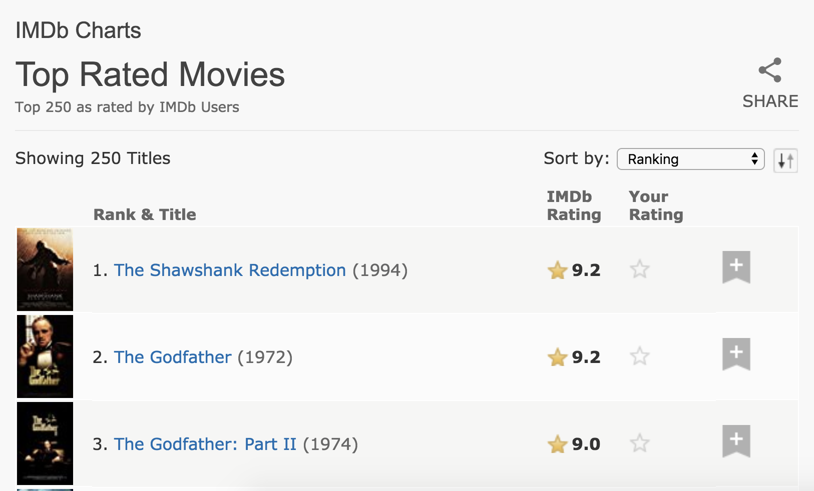

layout: true

<div class="my-footer">
<span>
<a href="http://datasciencebox.org" target="_blank">datasciencebox.org</a>
</span>
</div> 

---

```{r packages, echo=FALSE, message=FALSE, warning=FALSE}
library(tidyverse)
library(broom)
library(knitr)
library(DT)
library(emo)
library(openintro)
library(infer)
library(gridExtra)
```

```{r setup, include=FALSE}
# R options
options(
  htmltools.dir.version = FALSE, # for blogdown
  show.signif.stars = FALSE,     # for regression output
  warm = 1
  )
# Set dpi and height for images
opts_chunk$set(fig.height = 2.5, fig.width = 5, dpi = 300) 
# ggplot2 color palette with gray
color_palette <- list(gray = "#999999", 
                      salmon = "#E69F00", 
                      lightblue = "#56B4E9", 
                      green = "#009E73", 
                      yellow = "#F0E442", 
                      darkblue = "#0072B2", 
                      red = "#D55E00", 
                      purple = "#CC79A7")
htmltools::tagList(rmarkdown::html_dependency_font_awesome())
# For magick
dev.off <- function(){
  invisible(grDevices::dev.off())
}
# For ggplot2
ggplot2::theme_set(ggplot2::theme_bw())
```


## Announcements

- Extra credit due Mon, Apr 15 at 11:59p
    - [http://bit.ly/sta199-sp19-posttest](http://bit.ly/sta199-sp19-posttest)
    - Access Code: SSD2484ZHY
    - Course: STA 199, Section: 1
    - Up to 5 points on Exam 02. Must get at least 70% to receive any points

---

class: center, middle

# Scraping the web

---

## Scraping the web: what? why?

- Increasing amount of data is available on the web.

--

- These data are provided in an unstructured format: you can always copy&paste, but it's time-consuming and prone to errors.

--

- Web scraping is the process of extracting this information automatically and transform it into a structured dataset.

--

- Two different scenarios:
    - <font class="vocab">Screen scraping</font>: extract data from source code of website, with html parser (easy) or 
    regular expression matching (less easy).
    - <font class="vocab">Web APIs (application programming interface)</font>: website offers a set of structured http 
    requests that return JSON or XML files.
    
---

class: center, middle

# Web Scraping with rvest

---

### Hypertext Markup Language (HTML)

Most of the data on the web is still largely available as HTML - while it is structured (hierarchical / tree based) it often is not available in a form useful for analysis (flat / tidy).

```html
<html>
  <head>
    <title>This is a title</title>
  </head>
  <body>
    <p align="center">Hello world!</p>
  </body>
</html>
```

---

## rvest

.pull-left[
- **`rvest`** is a package that makes basic processing and manipulation of HTML data straight forward

- It's designed to work with pipelines built with `%>%`
]

.pull-right[

]

---

## Core functions in rvest:

- **`read_html`** - read HTML data from a url or character string.

- **`html_nodes`** - select specified nodes from the HTML document using CSS selectors.

- **`html_table`** - parse an HTML table into a data frame.

- **`html_text`** - extract tag pairs' content.

- **`html_name`** - extract tags' names.

- **`html_attrs`** - extract all of each tag's attributes.

- **`html_attr`** - extract tags' attribute value by name.

---

## SelectorGadget

- <font class="vocab">SelectorGadget</font>: Open source tool that eases CSS selector generation and discovery

- Easiest to use with the [Chrome Extension](https://chrome.google.com/webstore/detail/selectorgadget/mhjhnkcfbdhnjickkkdbjoemdmbfginb) 

- Learn more on the [Selector Gadget Vignette](https://cran.r-project.org/web/packages/rvest/vignettes/selectorgadget.html)


---

## Using SelectorGadget

- Click on the app logo next to the search bar
- A box will open in the bottom right of the website. Click on a page element that you 
would like your selector to match (it will turn green). SelectorGadget will then generate 
a minimal CSS selector for that element, and will highlight (yellow) everything that is 
matched by the selector. 
- Now click on a highlighted element to remove it from the selector (red), or click on an 
unhighlighted element to add it to the selector. Through this process of selection and 
rejection, SelectorGadget helps you come up with the appropriate CSS selector for your needs.

---

class: center, middle

# Top 250 movies on IMDB

---

## Top 250 movies on IMDB

Take a look at the source code, look for the tag `table` tag:
<br>
[http://www.imdb.com/chart/top](http://www.imdb.com/chart/top)



---

### First check to make sure you're allowed!

```{r warning=FALSE}
# install.packages("robotstxt")
library(robotstxt)
paths_allowed("http://www.imdb.com")
```

--

versus

```{r}
paths_allowed("http://www.facebook.com")
```


---

## Demo


Go to [rstudio.cloud](https://rstudio.cloud/) $\rightarrow$ Web scraping $\rightarrow$ Make a copy $\rightarrow$ `scrape-250.R`

---

## Select and format pieces

.small[
```{r message=FALSE}
library(rvest)

page <- read_html("http://www.imdb.com/chart/top")

titles <- page %>%
  html_nodes(".titleColumn a") %>%
  html_text()

years <- page %>%
  html_nodes(".secondaryInfo") %>%
  html_text() %>%
  str_replace("\\(", "") %>% # remove (
  str_replace("\\)", "") %>% # remove )
  as.numeric()

scores <- page %>%
  html_nodes("#main strong") %>%
  html_text() %>%
  as.numeric()
  
imdb_top_250 <- tibble(
  title = titles, 
  year = years, 
  score = scores
  )
```
]

---

```{r echo=FALSE, results='asis'}
imdb_top_250 %>% head(10)%>% rbind(rep("...", 3)) %>% kable(format = "html")
```

---

## Clean up / enhance

May or may not be a lot of work depending on how messy the data are

- See if you like what you got:

```{r}
glimpse(imdb_top_250)
```

- Add a variable for rank
```{r}
imdb_top_250 <- imdb_top_250 %>%
  mutate(
    rank = 1:nrow(imdb_top_250)
  )
```

---

```{r echo=FALSE, results='asis'}
imdb_top_250 %>% head(10)%>% rbind(rep("...", 3)) %>% kable(format = "html")
```

---

## Analyze

.question[
How would you go about answering this question: Which 1995 movies made the list?
]

---

```{r}
imdb_top_250 %>% 
  filter(year == 1995)
```

---

## Analyze

.question[
How would you go about answering this question: Which years have the most movies on the list?
]

--

```{r}
imdb_top_250 %>% 
  group_by(year) %>%
  summarise(total = n()) %>%
  arrange(desc(total)) %>%
  head(5)
```

---

## Visualize

.question[
How would you go about creating this visualization: Visualize the average yearly score for movies that made it on the top 250 list over time.
]

--

.small[
```{r echo=FALSE}
imdb_top_250 %>% 
  group_by(year) %>%
  summarise(avg_score = mean(score)) %>%
  ggplot(aes(y = avg_score, x = year)) +
    geom_point() +
    geom_smooth(method = "lm") +
    xlab("year")
```
]
---

## Potential challenges

- Unreliable formatting at the source
- Data broken into many pages
- ...

.question[
Compare the display of information at [raleigh.craigslist.org/search/apa](raleigh.craigslist.org/search/apa) to the list on the IMDB top 250 list. 

What challenges can you foresee in scraping a list of the available apartments?
]

---

class: middle, center

## Application Exercise

---

## Popular TV Shows

RStudio Cloud $\rightarrow$ Web scraping 

1. Scrape the list of most popular TV shows on IMDB: http://www.imdb.com/chart/tvmeter

2. Examine each of the first three (or however many you can get through) tv show subpage to also obtain genre and runtime.

3. Time permitting, also try to get the following:

    - How many episodes so far
    - Certificate
    - First five plot keywords
    - Country
    - Language

Add this information to the data frame you created in step 1.


