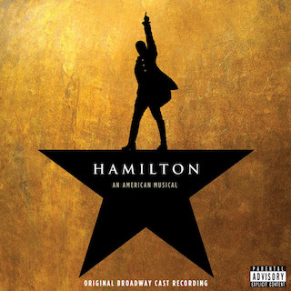
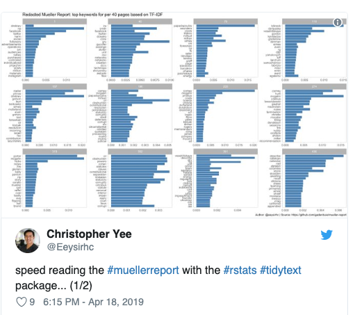

layout: true

<div class="my-footer">
<span>
<a href="http://datasciencebox.org" target="_blank">datasciencebox.org</a>
</span>
</div> 
```{r packages, echo=FALSE, message=FALSE, warning=FALSE}
library(tidyverse)
library(broom)
library(knitr)
library(DT)
library(emo)
library(openintro)
library(infer)
library(gridExtra)
```

```{r setup, include=FALSE}
# R options
options(
  htmltools.dir.version = FALSE, # for blogdown
  show.signif.stars = FALSE,     # for regression output
  warm = 1
  )
# Set dpi and height for images
opts_chunk$set(fig.height = 2.5, fig.width = 5, dpi = 300, warning = FALSE, message = FALSE) 
# ggplot2 color palette with gray
color_palette <- list(gray = "#999999", 
                      salmon = "#E69F00", 
                      lightblue = "#56B4E9", 
                      green = "#009E73", 
                      yellow = "#F0E442", 
                      darkblue = "#0072B2", 
                      red = "#D55E00", 
                      purple = "#CC79A7")
htmltools::tagList(rmarkdown::html_dependency_font_awesome())
# For magick
dev.off <- function(){
  invisible(grDevices::dev.off())
}
# For ggplot2
ggplot2::theme_set(ggplot2::theme_bw())
```

---

## Announcements

- Office hours: 
    - TAs have regular office hours Thursday - Sunday 
    - Professor Tackett: Thursday 10:30a - 12p and Friday 3:30p - 5p
    - Jose: Saturday, 12:30p - 2:30p
 
- All grades (except final project) should be in by the end of the day on Monday, April 29
  - At that point check Sakai to make sure your grades are correctly recorded
  - If you catch any issues (in recorded grade) email me -- for regrade
  requests use the usual regrade process, this is just for errors/missingness
  in recorded grades
  
- Extra credit 2: If we can get *both* the [post-study survey](https://duke.qualtrics.com/jfe/form/SV_6WfAY1m6YiHUmIl) and course evaluation response rates 
to above 90%, everyone gets +5 
pts on their total (not average) HW score.

---

## Announcements (cont.)

- Presentation schedule: Mon, April 29
  - Lab 01L: 2p - 3p
  - Lab 02L: 3p - 4p
  - Lab 03L: 4p - 5p
  
- There will be one more peer eval, specifically for the project, due Wed, May 1

---

class: center, middle

# Tidytext analysis

---

## Packages

In addition to `tidyverse` we will be using a few other packages today

```{r}
library(tidytext)
library(genius) # https://github.com/JosiahParry/genius
library(wordcloud)
library(reshape2)
library(gutenbergr) # repository of books
```

---

## Tidytext

- Using tidy data principles can make many text mining tasks easier, more effective, and consistent with tools already in wide use.

- Learn more at https://www.tidytextmining.com/.

---

## What is tidy text?

```{r}
text <- c("On your mark ready set let's go", 
          "dance floor pro",
          "I know you know I go psycho", 
          "When my new joint hit", 
          "just can't sit",
          "Got to get jiggy wit it", 
          "ooh, that's it")

text
```

---

## What is tidy text?

```{r}
text_df <- tibble(line = 1:7, text = text)

text_df
```

---

## What is tidy text?

```{r}
text_df %>%
  unnest_tokens(word, text)
```

---

class: center, middle

## Hamilton the `tidy` way!

.center[

]

---

## Let's get more data

We'll use the `genius` package to get song lyric data from [Genius](https://genius.com/).

- `genius_album()` allows you to download the lyrics for an entire album in a 
tidy format. 

- Input: Two arguments artists and album. Supply the quoted name of artist 
and the album (if it gives you issues check that you have the album name and 
artists as specified on [Genius](https://genius.com/)).

- Output: A tidy data frame with three columns:
    - `title`: track name
    - `track_n`: track number
    - `text`: lyrics

---

### "What's your name, man?"

```{r cache=TRUE}
hamilton <- genius_album(
  artist = "Original Broadway Cast of Hamilton", 
  album = "Hamilton (Original Broadway Cast Recording)"
  )
hamilton
```

---

## Save for later

```{r}
hamilton <- hamilton %>%
  mutate(
    album = "Hamilton (Original Broadway Cast Recording)",
    artist = "Original Broadway Cast of Hamilton"
    )
```

---

## What songs are in the album?

```{r}
hamilton %>%
  distinct(track_title)
```

---

### How long are the songs in Hamilton?

Length measured by number of lines

```{r}
hamilton %>%
  count(track_title) %>%
  arrange(desc(n))
```

---

## Tidy up your lyrics!

```{r}
hamilton_lyrics <- hamilton %>%
  unnest_tokens(word, lyric)

hamilton_lyrics
```

---

### What are the most common words?

```{r}
hamilton_lyrics %>%
  count(word) %>%
  arrange(desc(n))
```

---

## Stop words

- In computing, stop words are words which are filtered out before or after processing of natural language data (text).

- They usually refer to the most common words in a language, but there is not a single list of stop words used by all natural language processing tools.

---

## Spanish stop words

```{r}
get_stopwords(language = "es")
```

---

## Various lexicons

See `?get_stopwords` for more info.

```{r}
get_stopwords(source = "smart")
```

---

### What are the most common words?

```{r}
hamilton_lyrics %>%
  anti_join(get_stopwords(source = "smart")) %>%
  count(word) %>%
  arrange(desc(n))
```

---

### What are the most common words?

```{r eval=FALSE}
hamilton_lyrics %>%
  anti_join(get_stopwords(source = "smart")) %>%
  count(word) %>%
  arrange(desc(n)) %>%
  top_n(20) %>%
  ggplot(aes(fct_reorder(word, n), n)) +
    geom_col() +
    coord_flip() + 
    theme_minimal() +
    labs(title = "Frequency of Hamilton lyrics",
         y = "",
         x = "")
```

---

```{r echo=FALSE, message=FALSE, fig.height=4}
hamilton_lyrics %>%
  anti_join(get_stopwords(source = "smart")) %>%
  count(word) %>%
  arrange(desc(n)) %>%
  top_n(20) %>%
  ggplot(aes(fct_reorder(word, n), n)) +
    geom_col() +
    coord_flip() + 
    theme_minimal() +
    labs(title = "Frequency of Hamilton lyrics",
         y = "",
         x = "")
```

---

## Sentiment analysis

- One way to analyze the sentiment of a text is to consider the text as a combination of its individual words 

- and the sentiment content of the whole text as the sum of the sentiment content of the individual words

---

## Sentiment lexicons

.pull-left[
```{r}
get_sentiments("afinn")
```
]
.pull-right[
```{r}
get_sentiments("bing") 
```
]

---

## Sentiment lexicons

.pull-left[
```{r}
get_sentiments("nrc")
```
]
.pull-right[
```{r}
get_sentiments("loughran") 
```
]

---

## Sentiments in Hamilton lyrics

```{r}
hamilton_lyrics %>%
  inner_join(get_sentiments("bing")) %>%
  count(sentiment, word) %>%
  arrange(desc(n))
```

---

## Visualizing sentiments

```{r eval=FALSE}
hamilton_lyrics %>%
  inner_join(get_sentiments("bing")) %>%
  count(sentiment, word) %>%
  arrange(desc(n)) %>%
  group_by(sentiment) %>%
  top_n(10) %>%
  ungroup() %>%
  ggplot(aes(fct_reorder(word, n), n, fill = sentiment)) +
    geom_col() +
    coord_flip() +
    facet_wrap(~ sentiment, scales = "free_y") +
    theme_minimal() +
    labs(title = "Sentiments in Hamilton Lyrics",
         x = "")
```

---

```{r echo=FALSE, message=FALSE, fig.height = 4}
hamilton_lyrics %>%
  inner_join(get_sentiments("bing")) %>%
  count(sentiment, word) %>%
  arrange(desc(n)) %>%
  group_by(sentiment) %>%
  top_n(10) %>%
  ungroup() %>%
  ggplot(aes(fct_reorder(word, n), n, fill = sentiment)) +
    geom_col() +
    coord_flip() +
    facet_wrap(~ sentiment, scales = "free_y") +
    theme_minimal() +
    labs(title = "Sentiments in Hamilton Lyrics",
         x = "")
```

---

## Hamilton word cloud

```{r eval = F}
library(wordcloud)
set.seed(04252019)

hamilton_lyrics %>%
  anti_join(stop_words) %>%
  count(word) %>%
  with(wordcloud(word, n, max.words = 100))
```

---

## Hamilton word cloud

```{r echo = F, warning = F, message = F}
library(wordcloud)
set.seed(04252019)

hamilton_lyrics %>%
  anti_join(stop_words) %>%
  count(word) %>%
  with(wordcloud(word, n, max.words = 100))
```

---

## Hamilton sentiment word cloud

```{r eval = F, fig.height = 4}
library(reshape2)
set.seed(04252019)

hamilton_lyrics %>%
  inner_join(get_sentiments("bing")) %>%
  count(word, sentiment, sort = TRUE) %>%
  acast(word ~ sentiment, value.var = "n", fill = 0) %>%
  comparison.cloud(max.words = 100)
```

---

## Hamilton sentiment word cloud

```{r echo = F, warning = F, message = F, fig.height = 3.5}
library(reshape2)
set.seed(04252019)

hamilton_lyrics %>%
  inner_join(get_sentiments("bing")) %>%
  count(word, sentiment, sort = TRUE) %>%
  acast(word ~ sentiment, value.var = "n", fill = 0) %>%
  comparison.cloud(max.words = 100)
```

---

class: center, middle

### What do Beyonce, Ariana Grande, and Taylor Swift have in common? 


---

## Get the data

Get data from three artists:

```{r cache=TRUE}
beyonce <- genius_album(artist = "Beyonce", album = "Lemonade") %>%
  mutate(artist = "Beyonce", album = "Lemonade")

ariana <- genius_album(artist = "Ariana Grande", album = "thank you, next") %>%
  mutate(artist = "Ariana Grande", album = "thank you, next")

tswift <- genius_album(artist = "Taylor Swift", album = "reputation") %>%
  mutate(artist = "Taylor Swift", album = "reputation")
```

--

Combine data:

```{r}
ldoc <- bind_rows(beyonce, ariana, tswift)
```

---

## LDOC lyrics

```{r}
ldoc_lyrics <- ldoc %>%
  unnest_tokens(word, lyric)
```

---

## Common lyrics:

Without stop words:

```{r}
ldoc_lyrics %>%
  anti_join(get_stopwords(source = "smart")) %>%
  count(artist, word, sort = TRUE) # alternative way to sort
```

---

## Common lyrics

With stop words:

```{r}
ldoc_lyrics_counts <- ldoc_lyrics %>%
  count(artist, word, sort = TRUE)
```

---

## What is a document about?

- Term frequency
- Inverse document frequency

$$idf(\text{term}) = \ln{\left(\frac{n_{\text{documents}}}{n_{\text{documents containing term}}}\right)}$$

tf-idf is about comparing **documents** within a **collection**.

---

## Calculating tf-idf

This is not that exciting... What's the issue?

```{r}
ldoc_words <- ldoc_lyrics_counts %>%
  bind_tf_idf(word, artist, n)

ldoc_words
```

---

## Re-calculating tf-idf

```{r}
ldoc_words %>%
  bind_tf_idf(word, artist, n) %>%
  arrange(-tf_idf)
```

---

```{r echo=FALSE,message=FALSE, fig.height=4}
ldoc_words %>% 
  group_by(artist) %>% 
  top_n(10) %>% 
  ungroup() %>% 
  ggplot(aes(fct_reorder(word, tf_idf), tf_idf, fill = artist)) + 
    geom_col(alpha = 0.9, show.legend = FALSE) + coord_flip() + 
    facet_wrap(~artist, ncol=1, scales = "free") + 
    scale_y_continuous(expand = c(0,0)) + 
    theme_minimal() +
    labs(x = NULL, y = "tf-idf") +
    ylim(c(0, 0.017))
```

---

### `tidy`ing The Mueller Report

.center[

]

See more at [Using R To Analyze The Redacted Mueller Report](https://www.jlukito.com/blog/2019/4/20/using-r-to-analyze-the-redacted-mueller-report)

---

## Extra practice

Use the **tidytext** project in RStudio Cloud for additional practice with song lyrics and books.

---

## Acknowledgements

- Julia Silge: https://github.com/juliasilge/tidytext-tutorial

- Julia Silge and David Robinson: https://www.tidytextmining.com/

- Josiah Parry: https://github.com/JosiahParry/geniusR

---

class:  middle, center

### Congrats on completing STA 199 `r emo::ji("tada")`


